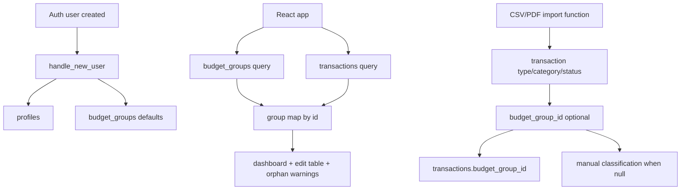

# Gerenciar Budget Groups Design

**Spec**: `.specs/features/001-gerenciar-budget-groups/spec.md`
**Status**: Draft

---

## Architecture Overview

`budget_group` deixa de ser um texto enum global em `transactions` e passa a ser uma entidade por usuario. A mudanca central e separar:

- `type`: natureza contabil da transacao (`Despesa`, `Receita`, `Transferência`)
- `budget group`: classificacao de orcamento do usuario para despesas e casos equivalentes

Para suportar rename, delete e metas editaveis sem quebrar vinculos, a relacao entre transacao e grupo passa a ser por ID. Os grupos default deixam de carregar qualquer papel estrutural obrigatorio alem de serem um seed inicial conveniente.

Nao ha skill `mermaid-studio` instalada nesta sessao, entao o diagrama segue inline.



### Architectural approach

- Introduzir `public.budget_groups` como tabela canonica por usuario.
- Migrar `transactions` de `budget_group text not null` para `budget_group_id uuid null`.
- Tratar `Receita` e `Transferência` como `type`, nao como grupos.
- Tratar os 3 grupos iniciais apenas como bootstrap editavel, nao como semantica obrigatoria do sistema.
- Ajustar o frontend para carregar grupos dinamicamente e lidar com transacoes orfas (`budget_group_id = null`).

---

## Code Reuse Analysis

### Existing Components to Leverage

| Component | Location | How to Use |
| --------- | -------- | ---------- |
| `handle_new_user()` | `supabase/migrations/20260603223000_init.sql` | Estender para semear grupos default no onboarding |
| `normalizeTransaction()` | `web/src/App.jsx` | Adaptar para normalizar `budget_group_id` e nome resolvido via mapa de grupos |
| `buildMonthData()` | `web/src/App.jsx` | Reescrever para usar grupos dinamicos e ignorar transacoes orfas sem mascara-las |
| `handleUpdate()` | `web/src/App.jsx` | Adaptar para atualizar `budget_group_id` em vez de `budget_group` |
| heuristicas `budgetGroupFor(...)` | `supabase/functions/_shared/*.ts` | Reduzir acoplamento: classificacao automatica nao deve depender de semantica fixa de grupos do usuario |

### Integration Points

| System | Integration Method |
| ------ | ------------------ |
| Supabase Auth | reaproveitar trigger de `handle_new_user` para criar grupos default |
| `transactions` | migrar coluna e fluxos de update/import para FK nullable |
| Edge Functions de importacao | revisar para que `budget_group_id` seja opcional e nao dependa de taxonomia fixa |
| Frontend React | carregar `budget_groups` em query propria e juntar no cliente |

---

## Components

### Database model: `budget_groups`

- **Purpose**: Persistir grupos de orcamento por usuario, com nome editavel, meta e identidade estavel.
- **Location**: `supabase/migrations/*.sql`
- **Interfaces**:
  - `insert default budget groups for new auth user`
  - `select/update/delete own budget groups via RLS`
- **Dependencies**: `auth.users`, `profiles`, RLS
- **Reuses**: padrao atual de `profiles`, trigger `handle_new_user`, trigger `set_updated_at`

### Transaction-group relation

- **Purpose**: Vincular transacoes a grupos do usuario sem depender de texto mutavel.
- **Location**: `public.transactions`
- **Interfaces**:
  - `transactions.budget_group_id uuid null references public.budget_groups(id) on delete set null`
- **Dependencies**: `public.budget_groups`
- **Reuses**: tabela `transactions`, indices por `user_id`

### Import classification boundary

- **Purpose**: Impedir que a importacao dependa de uma taxonomia obrigatoria de grupos do usuario.
- **Location**: `supabase/functions/_shared/`
- **Interfaces**:
  - `deriveImportedTransactionType(...)`
  - `deriveImportedTransactionCategory(...)`
  - `budget_group_id` pode permanecer `null` ate classificacao manual ou regra futura explicitamente configurada
- **Dependencies**: Supabase client nas Edge Functions, `transactions`
- **Reuses**: heuristicas atuais de classificacao por categoria/tipo/status

### Budget group management UI

- **Purpose**: Permitir CRUD de grupos e edicao de metas.
- **Location**: `web/src/` com extracao de modulos a partir de `App.jsx`
- **Interfaces**:
  - `loadBudgetGroups()`
  - `createBudgetGroup({ name, targetPercentage })`
  - `updateBudgetGroup(id, patch)`
  - `deleteBudgetGroup(id)`
- **Dependencies**: Supabase JS, sessao autenticada
- **Reuses**: padrao atual de mutation com erro explicito e refresh/estado local

### Orphan transaction UX

- **Purpose**: Tornar transacoes sem grupo visiveis e reclassificaveis.
- **Location**: `web/src/`
- **Interfaces**:
  - indicador visual de `Sem grupo`
  - filtro opcional de pendencias
  - select de reclassificacao com grupos disponiveis
- **Dependencies**: `transactions`, `budget_groups`
- **Reuses**: tabela editavel atual

---

## Data Models

### BudgetGroup

```ts
interface BudgetGroup {
  id: string
  userId: string
  name: string
  targetPercentage: number
  createdAt: string
  updatedAt: string
}
```

**Relationships**:

- pertence a um `auth.users`
- pode ser referenciado por varias transacoes

### Transaction

```ts
interface Transaction {
  id: string
  userId: string
  date: string
  description: string
  amount: number
  type: 'Despesa' | 'Receita' | 'Transferência'
  category: string
  budgetGroupId: string | null
  status: 'Confirmado' | 'Pendente' | 'Ignorar'
  notes: string
}
```

**Relationships**:

- `budgetGroupId` referencia `BudgetGroup.id`
- pode ficar `null` apos exclusao do grupo ou quando nao houver grupo default resolvivel

### UI projection

```ts
interface TransactionViewModel {
  id: string
  date: string
  description: string
  amount: number
  type: 'Despesa' | 'Receita' | 'Transferência'
  category: string
  budgetGroupId: string | null
  budgetGroupName: string | null
  status: 'Confirmado' | 'Pendente' | 'Ignorar'
  notes: string
  needsReclassification: boolean
}
```

**Relationships**:

- `budgetGroupName` e resolvido no cliente a partir do mapa de `BudgetGroup`
- `needsReclassification` e `true` quando `type === 'Despesa'` e `budgetGroupId == null`

---

## Schema Design

### New table

`public.budget_groups`

Campos propostos:

- `id uuid primary key default gen_random_uuid()`
- `user_id uuid not null references auth.users(id) on delete cascade`
- `name text not null`
- `target_percentage numeric(5,2) not null`
- `created_at timestamptz not null default ...`
- `updated_at timestamptz not null default ...`

Constraints propostos:

- unique `(user_id, name)` para evitar duplicidade exata dentro do mesmo usuario
- RLS por `user_id`

### Transaction migration

Mudanca proposta em `public.transactions`:

- adicionar `budget_group_id uuid null references public.budget_groups(id) on delete set null`
- backfill de `budget_group_id` a partir do texto legado
- remover dependencia do check `transactions_budget_group_check`
- manter `type`, `category` e `status` como enums textuais no schema
- opcionalmente manter a coluna `budget_group` apenas durante migracao e remove-la na mesma feature, para evitar drift

Decisao: remover a coluna textual ao fim da migracao. Manter as duas ao mesmo tempo prolonga inconsistencias e contradiz o objetivo da feature.

### User bootstrap

`handle_new_user()` passa a:

1. criar/atualizar `profiles`
2. inserir grupos default:
   - `Necessidades`, `50`
   - `Desejos`, `30`
   - `Futuro`, `20`

Os defaults existem apenas como experiencia inicial. Depois disso, o usuario pode renomear, excluir ou substituir completamente esses grupos sem que o sistema tente preservar uma semantica escondida.

---

## Frontend Design

### Data loading

O app deve carregar:

1. sessao/auth
2. `budget_groups` do usuario
3. `transactions` do usuario

As transacoes passam a vir com `budget_group_id`; o nome exibido e resolvido no cliente.

### State shape

Separar o estado de:

- `budgetGroups`
- `transactions`
- `selectedMonth`
- `savingId`
- erros/feedback

Essa feature cruza CRUD de grupos + CRUD de transacoes + agregacao. Pelo guardrail de `CONCERNS.md`, isso ja passa do limite aceitavel para manter tudo em um unico `App.jsx`. O design assume modularizacao minima:

- `components/BudgetGroupManager.jsx`
- `components/TransactionsTable.jsx`
- `lib/transactions.js`
- `lib/budgetGroups.js`

### Aggregation behavior

- despesas confirmadas com `budget_group_id` valido entram nos totais do grupo correspondente
- receitas continuam sendo agregadas por `type === 'Receita'`
- transferencias continuam fora do gasto total, salvo regra especifica futura
- transacoes com `budget_group_id = null` nao entram silenciosamente em nenhum grupo
- a UI deve expor a contagem/valor de transacoes sem grupo

### Edit behavior

- o select de grupo da transacao lista apenas grupos do usuario
- para `Receita` e `Transferência`, o app nao deve depender de pseudo-grupos com o mesmo nome
- ao trocar `type` para `Receita` ou `Transferência`, o app pode limpar `budget_group_id` por consistencia
- ao trocar `type` para `Despesa`, o grupo pode continuar `null` ate o usuario reclassificar

---

## Import And Classification Design

### Current problem

Hoje as heuristicas de importacao retornam nomes de grupo fixos, como `Necessidades` e `Futuro`. Isso deixa de ser contrato estavel quando o usuario pode renomear ou excluir grupos.

### Proposed model

Fluxo:

1. classificar `type`, `category`, `status`
2. para grupos inferidos pelas regras atuais, tentar localizar por nome exato um dos grupos iniciais do usuario: `Necessidades`, `Desejos`, `Futuro`
3. se encontrar correspondencia exata, gravar o `budget_group_id`
4. caso contrario, gravar `budget_group_id = null`
5. deixar a reclassificacao para o usuario na UI

Isso limita o acoplamento a uma heuristica transitória e previsivel. Se o usuario renomear ou remover esses grupos, a importacao para de autoatribuir e cai para classificacao manual.

### Legacy Python tools

Os scripts em `tools/` podem permanecer emitindo `budget_group` textual no curto prazo, porque sao fluxo local/legado. Mas essa convivencia deve ser tratada como compatibilidade temporaria de artefatos operacionais, nao como contrato canonico do Supabase.

Se esses artefatos voltarem a ser fonte primaria para importacao, sera necessario alinhar tambem esse runtime.

---

## Error Handling Strategy

| Error Scenario | Handling | User Impact |
| -------------- | -------- | ----------- |
| Falha ao criar grupos default no onboarding | transacao SQL/trigger deve falhar de forma visivel no ambiente de setup | usuario novo nao fica com estado parcialmente configurado |
| Exclusao de grupo com transacoes vinculadas | FK `on delete set null` | transacoes continuam acessiveis, mas aparecem sem grupo |
| Query de grupos falha no frontend | mostrar erro e nao renderizar tela como se lista estivesse vazia | evita sobrescrever classificacoes por engano |
| Importacao nao encontra `Necessidades`, `Desejos` ou `Futuro` por nome exato | salvar `budget_group_id = null` | transacao importa, mas fica pendente de reclassificacao |
| Usuario tenta salvar grupo duplicado | constraint + mensagem amigavel | evita ambiguidade de nomes |
| Dashboard recebe transacao sem grupo | excluir dos totais por grupo e mostrar pendencia | evita contagem enganosa |

---

## Tech Decisions

| Decision | Choice | Rationale |
| -------- | ------ | --------- |
| Representacao de grupo em transacao | FK `budget_group_id` nullable | rename e delete seguros exigem identidade estavel |
| Defaults editaveis | seed inicial com lookup transitório por nome exato na importacao | entrega comportamento util agora sem reintroduzir chave estrutural escondida |
| Exclusao de grupo | `on delete set null` | implementa exatamente o comportamento desejado para orfandade |
| Receita e Transferência | ficam em `type`, nao em `budget_group` | evita misturar natureza contabil com classificacao de orcamento |
| Carregamento no frontend | queries separadas para `budget_groups` e `transactions` | menor acoplamento e mais simples que introduzir backend custom |
| Modularizacao da UI | extracao minima de `App.jsx` | a feature cruza limites ja apontados em `CONCERNS.md` |

---

## Open Implementation Notes

- A migracao precisa decidir como tratar linhas legadas com `budget_group` textual `Receita`, `Transferência` e `Ignorar`. O design assume:
  - `Receita` e `Transferência` viram `budget_group_id = null`
  - `Ignorar` tambem vira `null`, com a semantica preservada por `status`
- Se existir comparacao visual fixa baseada em `GROUP_TARGETS`, ela deve sair do codigo e passar a ser derivada de `budget_groups.target_percentage`.
- Nao encontrei no codebase atual um contrato pronto para nested select de `transactions` com `budget_groups`; por isso o design prefere duas queries e join no cliente.
- Como a organizacao por grupos passa a ser livre, qualquer autoatribuicao de grupo na importacao deve ser conservadora. Nesta fase, a unica tentativa automatica aceita e o lookup por nome exato de `Necessidades`, `Desejos` e `Futuro`. Quando houver duvida, `null` e melhor que inferir um grupo indevido.
