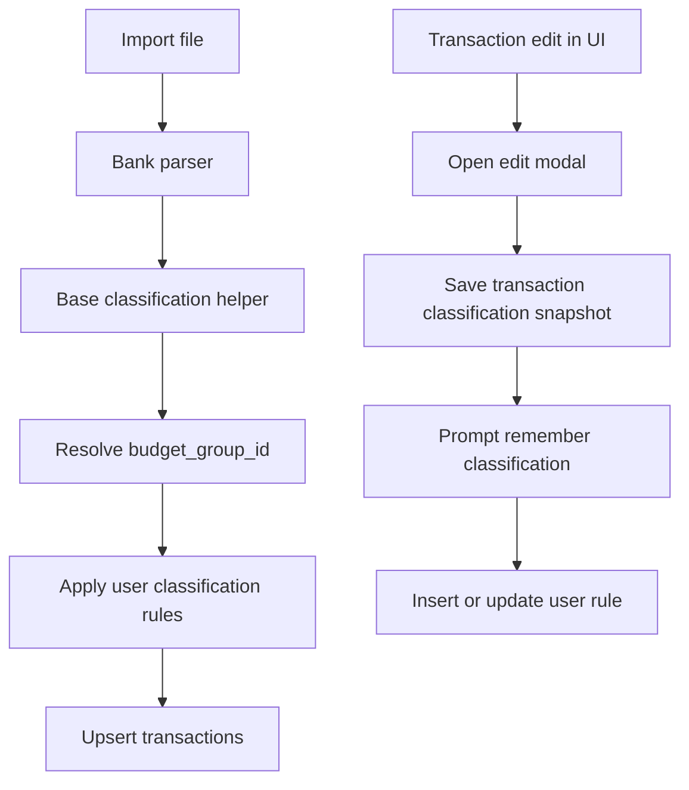

# Regras De Classificacao Por Usuario Design

**Spec**: `.specs/features/002-regras-classificacao-por-usuario/spec.md`
**Context**: `.specs/features/002-regras-classificacao-por-usuario/context.md`
**Status**: Draft

---

## Architecture Overview

A feature adiciona uma camada persistida de override por usuario sobre o pipeline atual de classificacao. As heuristicas hardcoded continuam existindo como baseline por banco, mas deixam de ser a ultima palavra. O contrato canonico passa a ser:

1. helper base classifica `type`, `category`, `status` e `budget_group_name`
2. helper compartilhado resolve `budget_group_id`
3. motor de regras do usuario tenta encontrar override por `nome` ou `nome + valor` para `type`, `category` e `budget_group_id`
4. transacao final segue para `upsert` em `public.transactions`

Regra de precedencia principal: se uma regra do usuario combinar com a transacao, ela vence o resultado produzido pela heuristica base.

No frontend, a edicao manual deixa de ser inline por campo e passa a acontecer em um modal com submit unico. Depois do save bem-sucedido, o sistema pode abrir o prompt de aprendizado quando o conjunto de classificacao tiver sido alterado.

Regra de editabilidade principal: campos que participam da chave deterministica de importacao nao entram no escopo editavel do modal, para preservar `external_id`, idempotencia de `upsert` e rastreabilidade da linha importada.

Regra de matching principal: o texto da regra e a descricao importada passam por normalizacao identica e sao comparados por match parcial. No modo `nome + valor`, o valor monetario precisa bater exatamente alem do match parcial no texto.



## Code Reuse Analysis

### Existing Components to Leverage

| Component | Location | How to Use |
| --------- | -------- | ---------- |
| `resolveImportedTransactionBudgetGroups()` | `supabase/functions/_shared/budget-groups.ts` | Manter como etapa anterior ao override por usuario, para preencher `budget_group_id` quando o baseline apontar grupo default |
| `parseNubankCsv()` | `supabase/functions/_shared/nubank.ts` | Continuar produzindo classificacao base antes do override |
| parser Santander fatura e extrato | `supabase/functions/_shared/santander.ts`, `supabase/functions/_shared/santander-account.ts` | Mesmo papel do Nubank, sem duplicar motor de regras |
| `useTransactionEditing()` | `web/src/hooks/useTransactionEditing.js` | Adaptar para salvar um payload completo vindo do modal e detectar mudanca no snapshot de classificacao |
| `useTransactionsData()` | `web/src/hooks/useTransactionsData.js` | Expandir para carregar tambem as regras do usuario |
| `TransactionTable` | `web/src/components/TransactionTable.jsx` | Reaproveitar a listagem, trocando os selects inline por acionamento do modal |
| `DashboardView` / `App` | `web/src/components/DashboardView.jsx`, `web/src/App.jsx` | Servir de base para introduzir navegacao simples entre dashboard e pagina de regras |

### Integration Points

| System | Integration Method |
| ------ | ------------------ |
| Supabase database | nova tabela de regras com RLS por `user_id` |
| Edge Functions | helper compartilhado para carregar e aplicar regras do usuario |
| Frontend React | novo estado para prompt e listagem de regras |
| Budget groups | regras podem apontar para `budget_group_id` existente ou `null` |

---

## Components

### Database model: `transaction_classification_rules`

- **Purpose**: Persistir regras de override de classificacao por usuario.
- **Location**: `supabase/migrations/<novo_timestamp>_create_transaction_classification_rules.sql`
- **Interfaces**:
  - `select/insert/update/delete own rules via RLS`
  - unicidade por `(user_id, match_mode, match_description_normalized, match_amount)`
- **Dependencies**: `auth.users`, `budget_groups`, trigger `set_updated_at`
- **Reuses**: padrao de `budget_groups` e `transactions`

Campos propostos:

- `id uuid primary key default gen_random_uuid()`
- `user_id uuid not null references auth.users(id) on delete cascade`
- `match_mode text not null check (match_mode in ('description', 'description_amount'))`
- `match_description text not null`
- `match_description_normalized text not null`
- `match_amount numeric(12, 2) null`
- `type text not null check (type in ('Despesa', 'Receita', 'Transferência'))`
- `category text not null`
- `budget_group_id uuid null references public.budget_groups(id) on delete set null`
- `created_at timestamptz not null default timezone('utc'::text, now())`
- `updated_at timestamptz not null default timezone('utc'::text, now())`

Constraint adicional:

- `match_amount is null` para `description`
- `match_amount is not null` para `description_amount`

Regra de unicidade:

- para `description_amount`, a combinacao `(user_id, match_description_normalized, match_amount)` deve ser unica
- o `match_mode` continua no indice/constraint para simplificar o upsert uniforme entre os modos

### Shared matcher module

- **Purpose**: Concentrar normalizacao de descricao, resolucao de precedencia e aplicacao de overrides.
- **Location**: `supabase/functions/_shared/classification-rules.ts`
- **Interfaces**:
  - `normalizeRuleDescription(description: string): string`
  - `loadUserClassificationRules(supabase, userId): Promise<UserClassificationRule[]>`
  - `applyUserClassificationRules(transaction, rules): ImportedTransaction`
- **Dependencies**: Supabase client, `ImportedTransaction`
- **Reuses**: contrato existente de importacao ja resolvido para `budget_group_id`

Regra de precedencia:

1. match `description_amount`
2. match `description`
3. dentro do mesmo modo, vencer a descricao normalizada mais longa
4. persistindo empate, `updated_at desc`

Regra de comparacao:

1. normalizar descricao da transacao e descricao da regra
2. aplicar match parcial por substring normalizada
3. no modo `description_amount`, exigir tambem igualdade exata de valor
4. se mais de uma regra do mesmo modo combinar, ordenar por comprimento decrescente da descricao normalizada

### Import pipeline adapter

- **Purpose**: Encaixar o matcher sem duplicar logica entre bancos.
- **Location**: `supabase/functions/import-nubank-csv/index.ts`, `supabase/functions/import-santander-pdf/index.ts`
- **Interfaces**:
  - receber transacoes parseadas
  - resolver `budget_group_id`
  - carregar regras do usuario uma vez por request
  - aplicar overrides antes do `upsert`
- **Dependencies**: parser do banco, helper de grupos, helper de regras
- **Reuses**: fluxo atual de `upsert` por `user_id, external_id`

### Learning prompt UX

- **Purpose**: Converter recategorizacao manual em regra reutilizavel.
- **Location**: `web/src/hooks/useTransactionEditing.js`, novos componentes `web/src/components/TransactionEditModal.jsx` e possivelmente `web/src/components/ClassificationRulePrompt.jsx`
- **Interfaces**:
  - `openTransactionEditModal(transaction)`
  - `saveTransactionEdit(transactionPatch)`
  - `rememberClassification(mode)`
  - `dismissRememberPrompt()`
- **Dependencies**: `transactions`, `transaction_classification_rules`
- **Reuses**: fluxo atual de update da transacao, agora com payload consolidado

### Transaction edit modal

- **Purpose**: Permitir correcao manual focada em classificacao sem alterar campos estruturais usados pela importacao.
- **Location**: `web/src/components/TransactionEditModal.jsx`
- **Editable fields**:
  - `type`
  - `category`
  - `budget_group_id`
- **Read-only fields**:
  - `date`
  - `description`
  - `amount`
  - `account`
  - `institution`

### Rules management UI

- **Purpose**: Dar gerenciamento completo das regras persistidas em uma pagina separada.
- **Location**: `web/src/components/ClassificationRulesPage.jsx`
- **Interfaces**:
  - list rules
  - create rule
  - edit rule
  - delete rule
- **Dependencies**: `useTransactionsData` ou hook dedicado
- **Reuses**: padrao de tabelas/paineis atual

### Rules management navigation

- **Purpose**: Permitir alternancia entre dashboard e pagina de regras sem misturar responsabilidades na mesma tela.
- **Location**: `web/src/App.jsx`, `web/src/components/DashboardView.jsx`
- **Interfaces**:
  - `activeView`
  - `setActiveView('dashboard' | 'classification-rules')`
- **Dependencies**: estado autenticado atual
- **Reuses**: estrutura existente de layout autenticado

---

## Data Models

### UserClassificationRule

```ts
interface UserClassificationRule {
  id: string
  userId: string
  matchMode: 'description' | 'description_amount'
  matchDescription: string
  matchDescriptionNormalized: string
  matchAmount: number | null
  type: 'Despesa' | 'Receita' | 'Transferência'
  category: string
  budgetGroupId: string | null
  status: 'Confirmado' | 'Pendente' | 'Ignorar'
  createdAt: string
  updatedAt: string
}
```

### ImportedTransaction override shape

```ts
interface ImportedTransaction {
  user_id: string
  date: string
  description: string
  amount: number
  type: 'Despesa' | 'Receita' | 'Transferência'
  category: string
  budget_group_id: string | null
  account: string
  institution: string
  status: 'Confirmado' | 'Pendente' | 'Ignorar'
  notes: string
  invoice: string
  installment: string
  external_id: string
  source: string
}
```

O matcher nao cria transacoes novas. Ele apenas devolve um `ImportedTransaction` com `type`, `category`, `budget_group_id` e `status` possivelmente alterados.
O matcher nao cria transacoes novas. Ele apenas devolve um `ImportedTransaction` com `type`, `category` e `budget_group_id` possivelmente alterados. `status` permanece fora da regra do usuario e continua vindo do baseline de importacao.

---

## Schema Design

### New table

`public.transaction_classification_rules`

Indices propostos:

- `(user_id, match_description_normalized)`
- `(user_id, match_description_normalized, match_amount)`

Constraint/indice unico proposto:

- unique `(user_id, match_mode, match_description_normalized, match_amount)`

Comportamento esperado:

- regras `description_amount` fazem upsert por essa chave unica por usuario
- isso impede duplicidade da combinacao `nome + valor` dentro do mesmo usuario

RLS proposto:

- `select_own`
- `insert_own`
- `update_own`
- `delete_own`

Trigger de integridade proposto:

- garantir que `budget_group_id`, quando presente, pertence ao mesmo `user_id` da regra

### No transaction schema change required

O schema atual de `transactions` ja possui `budget_group_id`, `category`, `type` e `status`, entao a feature nao exige nova mudanca em `transactions`. A persistencia adicional fica isolada na nova tabela de regras.

---

## Frontend Design

### Prompt lifecycle

Fluxo proposto:

1. usuario abre o modal de edicao de uma transacao
2. usuario altera apenas os campos editaveis do conjunto de classificacao
3. `useTransactionEditing()` persiste a mudanca consolidada em `transactions`
4. apos sucesso, se o snapshot de classificacao mudou, o hook abre um prompt leve
5. usuario escolhe:
   - `Nao lembrar`
   - `Lembrar pelo nome`
   - `Lembrar pelo nome + valor`
6. se aceitar, o frontend faz upsert em `transaction_classification_rules` com o snapshot completo da classificacao (`type`, `category`, `budget_group_id`)

### Loading strategy

`useTransactionsData()` passa a carregar tambem `transaction_classification_rules` para alimentar a pagina dedicada de regras.

### Separate page behavior

A area autenticada passa a ter ao menos duas views:

1. dashboard/importacao/revisao de transacoes
2. pagina separada de regras de classificacao

A pagina de regras deve permitir:

- listar regras existentes
- criar nova regra manualmente
- editar regra existente
- excluir regra
- alertar quando a descricao informada for curta ou potencialmente generica para match parcial

### UX guardrails

- nao abrir prompt ao editar `notes`
- nao disparar save parcial por campo dentro da tabela
- nao permitir edicao de campos usados na formacao de `external_id`
- nao reabrir prompt automaticamente para a mesma transacao enquanto a interacao atual nao for resolvida
- mensagens devem deixar claro que a regra afetara importacoes futuras, nao transacoes antigas

---

## Validation Strategy

### Database

- revisar migration e RLS
- validar constraint de consistencia com `budget_group_id`

### Edge Functions

- cobrir helper puro de normalizacao/match com casos de:
  - sem regra
  - match por descricao
  - match por descricao + valor
  - desempate

### Frontend

- `npm run lint`
- `npm run build`
- validacao manual do prompt de aprendizado, da criacao de regra e da exclusao

---

## Risks

- A normalizacao de descricao pode ficar fraca demais e gerar pouco reaproveitamento.
- Match por descricao simples pode capturar transacoes diferentes com mesmo texto em contextos distintos.
- O prompt disparado a cada edicao de classificacao pode ficar intrusivo se nao for bem limitado.

## Deferred Improvements

- adicionar filtros opcionais por `institution`, `account` ou `source`
- registrar metricas de quantas importacoes reaproveitaram cada regra
