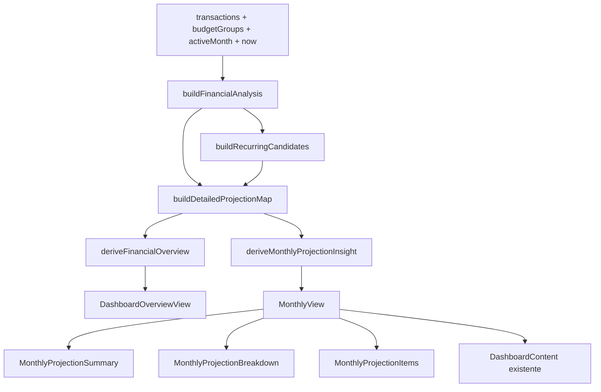

# Detalhar Projecoes Na Analise Mensal Design

**Spec**: `.specs/features/005-detalhar-projecoes-na-analise-mensal/spec.md`
**Context**: `.specs/features/005-detalhar-projecoes-na-analise-mensal/context.md`
**Status**: Approved

---

## 1. Objetivo Do Design

Adicionar na pagina `Mensal`, para o mes atual e meses futuros, uma visao detalhada da projecao financeira que:

- explique quais valores ja estao registrados na base
- explique quais valores foram inferidos como provaveis
- apresente agregados por grupo e categoria
- mostre os itens individuais que compoem cada agregado
- no mes atual, calcule o saldo projetado disponivel e uma sugestao semanal de gasto
- preserve a mesma heuristica de recorrencia usada pela dashboard

A feature nao adiciona queries, tabelas ou migrations. Toda a analise continua sendo derivada no frontend a partir das transacoes e grupos ja carregados.

---

## 2. Findings Da Revisao

A revisao do primeiro desenho encontrou pontos que precisavam ser fechados antes da criacao das tarefas.

### 2.1 Receita projetada hoje mistura origens diferentes

`ProjectionMonth.revenue` soma:

- receitas persistidas para o mes
- receitas recorrentes inferidas

Para o detalhamento, um unico total nao e suficiente. O novo modelo deve separar `registeredRevenue` e `probableRevenue`, mantendo um total derivado quando necessario.

### 2.2 "Confirmado" nao existe como estado persistido

A coluna `transactions.status` foi removida pela migration `20260611102000_drop_transactions_status.sql`. Portanto, o sistema nao consegue afirmar que uma transacao esta liquidada ou confirmada operacionalmente.

Terminologia adotada:

- **Registrado**: existe como transacao persistida na base.
- **Provavel**: foi inferido pela heuristica de recorrencia e nao existe na base.
- **Realizado ate hoje**: transacao registrada com data anterior ou igual ao dia atual.
- **Restante registrado**: transacao registrada com data posterior ao dia atual.

A UI nao deve chamar um item de "pago", "liquidado" ou "confirmado" porque o modelo atual nao sustenta essas afirmacoes.

### 2.3 O dia atual e ambiguo sem hora ou status

Uma transacao possui apenas uma data, sem horario e sem estado de liquidacao. Para obter uma regra deterministica:

- transacao registrada com `date <= today` entra no saldo realizado
- transacao registrada com `date > today` entra no restante do mes
- item provavel com `expectedDate >= today` continua no restante, pois ainda nao existe registro que comprove sua realizacao

Essa assimetria e intencional. Persistencia e a unica evidencia disponivel de que o item ja ocorreu.

### 2.4 A tela Mensal pode navegar alem do horizonte da dashboard

A dashboard resume apenas o mes atual e os dois meses seguintes. Entretanto, `buildMonthRange()` pode incluir meses mais distantes quando existem parcelas futuras persistidas.

Decisao:

- a dashboard mantem o horizonte atual de tres meses
- a `Mensal` gera o detalhamento sob demanda para qualquer mes atual ou futuro disponivel no seletor
- o mesmo conjunto de candidatos recorrentes e aplicado ao mes selecionado, sem alterar a regra que identifica recorrencia

### 2.5 O saldo disponivel nao e saldo bancario

O calculo usa apenas o fluxo do mes selecionado. Ele nao considera:

- saldo inicial de contas
- limite de cartao
- investimentos ou reservas fora das transacoes do mes
- transferencias entre contas

A UI deve apresentar o indicador como **Saldo projetado do mes**, acompanhado de texto explicativo. Nao deve sugerir que se trata do saldo bancario consolidado.

### 2.6 Valor semanal negativo nao e uma sugestao utilizavel

O calculo assinado continua sendo:

```text
weeklyBalance = availableToSpend / weeksRemaining
```

Para apresentacao:

- se `weeklyBalance > 0`, mostrar o valor como sugestao de gasto semanal
- se `weeklyBalance <= 0`, mostrar sugestao de `R$ 0,00` e destacar o deficit projetado separadamente

Isso preserva a formula escolhida pelo usuario sem recomendar um gasto negativo.

### 2.7 A implementacao inicial duplicaria trabalho

Calcular `buildFinancialOverview()` e `buildMonthlyProjectionInsight()` de forma independente repetiria:

- varredura de transacoes
- deteccao de candidatos recorrentes
- deteccao de matches persistidos

O design revisado introduz uma analise combinada para que dashboard e mensal sejam derivadas da mesma execucao.

---

## 3. Architecture Overview

O nucleo da projecao passa a ficar em `web/src/lib/financialAnalysis.ts`. `transactions.ts` preserva as APIs publicas existentes por reexport ou wrapper, enquanto os componentes React recebem um view-model pronto e nao implementam regras financeiras.

Nao ha skill `mermaid-studio` instalada nesta sessao, entao o diagrama segue inline.



### Architectural approach

- `financialAnalysis.ts` passa a ser a fonte canonica de projecao detalhada.
- `transactions.ts` preserva compatibilidade para os consumidores atuais.
- `buildFinancialAnalysis()` produz dashboard e detalhe mensal em uma unica operacao.
- `buildFinancialOverview()` permanece como wrapper publico para compatibilidade com testes e chamadas existentes.
- `useDashboardState()` passa a expor `monthlyProjectionInsight`.
- `MonthlyView` apenas decide posicionamento e estados de renderizacao.
- Novos componentes recebem dados prontos, sem recalcular valores monetarios.
- A feature nao altera Supabase, importadores ou regras de classificacao.

---

## 4. Terminologia Canonica

| Termo | Definicao | Origem |
| --- | --- | --- |
| Registrado | Lancamento persistido em `transactions` | Supabase |
| Provavel | Lancamento sintetizado a partir de recorrencia detectada | Frontend |
| Realizado | Registrado no mes atual com data `<= today` | Derivado |
| Restante registrado | Registrado no mes atual com data `> today`, ou qualquer registrado em mes futuro | Derivado |
| Receita restante | Receita registrada restante + receita provavel | Derivado |
| Despesa restante | Despesa registrada restante + despesa provavel | Derivado |
| Saldo realizado | Receitas realizadas - despesas realizadas | Derivado |
| Saldo projetado do mes | Saldo realizado + receitas restantes - despesas restantes | Derivado |
| Sugestao semanal | Parte positiva do saldo projetado dividida pelas semanas restantes | Derivado |

`Transferencia` nao e receita nem despesa para os calculos de saldo. Ela permanece visivel na tabela mensal existente, mas nao entra no bloco de projecao.

---

## 5. Projection Engine

### 5.1 API publica combinada

Adicionar:

```ts
type FinancialAnalysis = {
  overview: FinancialOverview
  monthlyProjectionInsight: MonthlyProjectionInsight | null
}

function buildFinancialAnalysis(
  transactions: Transaction[],
  budgetGroups: BudgetGroup[],
  activeMonth: string,
  now?: Date,
): FinancialAnalysis
```

Responsabilidades:

1. determinar o mes atual e o dia local atual
2. construir candidatos recorrentes uma unica vez
3. montar as projecoes detalhadas necessarias
4. derivar o overview da dashboard
5. derivar o insight do mes selecionado

### 5.2 Compatibilidade

Manter:

```ts
function buildFinancialOverview(
  transactions: Transaction[],
  budgetGroups: BudgetGroup[],
  now?: Date,
): FinancialOverview
```

Esse wrapper chama o mesmo nucleo interno usando o mes atual como `activeMonth`. Assim:

- testes existentes continuam validos
- consumidores externos nao quebram
- a logica nao e duplicada

### 5.3 Meses calculados

O engine monta um conjunto unico de meses:

```text
projectionMonthKeys =
  currentMonth
  + nextMonth
  + secondNextMonth
  + activeMonth, quando activeMonth >= currentMonth
```

Consequencias:

- a dashboard continua com tres meses
- um mes futuro distante pode ser analisado na `Mensal`
- um mes passado nao gera `MonthlyProjectionInsight`
- meses duplicados sao eliminados antes do calculo

### 5.4 Complexidade esperada

Para `T` transacoes, `C` candidatos recorrentes e `M` meses calculados:

```text
O(T + C * M)
```

No fluxo normal, `M` varia entre 3 e 4. Nao ha nova chamada de rede e nao ha agregacao por render dentro dos componentes visuais.

---

## 6. Recurring Candidate Model

O tipo atual precisa carregar a base explicativa da estimativa.

```ts
type RecurringCandidate = {
  description: string
  normalizedDescription: string
  amount: number
  type: Exclude<TransactionType, 'Transferência'>
  category: string
  budgetGroupId: string | null
  occurrenceCount: number
  observedMonthCount: number
  lastObservedDate: string
  expectedDayOfMonth: number
}
```

### Regras preservadas

- considerar apenas os quatro meses recentes usados atualmente
- exigir ocorrencia em pelo menos dois meses diferentes
- agrupar por `type + normalizedDescription`
- excluir transferencias
- excluir transacoes parceladas
- usar a media aritmetica dos valores observados
- usar categoria e grupo da transacao mais recente
- nao sintetizar item quando ja existir match persistido do mesmo tipo e descricao no mes alvo

### Nova informacao derivada

- `occurrenceCount`: quantidade de transacoes usadas na media
- `observedMonthCount`: quantidade de meses distintos
- `lastObservedDate`: data da ocorrencia mais recente
- `expectedDayOfMonth`: dia da ocorrencia mais recente

Nenhuma dessas adicoes muda a heuristica de classificacao de recorrencia. Elas apenas tornam a estimativa auditavel e permitem posiciona-la no calendario.

---

## 7. Date And Time Rules

### 7.1 Data local

O sistema deve criar `todayKey` a partir de `Date#getFullYear()`, `getMonth()` e `getDate()`.

Nao usar `toISOString().slice(0, 10)`, pois UTC pode deslocar o dia no fuso local do usuario.

Formato:

```text
YYYY-MM-DD
```

### 7.2 Data esperada de recorrencia

Para cada candidato e mes alvo:

1. usar `expectedDayOfMonth`
2. descobrir o ultimo dia valido do mes alvo
3. limitar o dia esperado ao ultimo dia valido
4. gerar `expectedDate` em formato `YYYY-MM-DD`

Exemplo:

```text
dia observado: 31
mes alvo: fevereiro de 2027
data esperada: 2027-02-28
```

### 7.3 Corte do mes atual

Itens registrados:

| Condicao | Classificacao |
| --- | --- |
| `date <= todayKey` | realizado |
| `date > todayKey` | restante registrado |

Itens provaveis:

| Condicao | Classificacao |
| --- | --- |
| existe match registrado no mes | nao sintetizar |
| `expectedDate < todayKey` | nao incluir no restante |
| `expectedDate >= todayKey` | incluir no restante |

### 7.4 Mes futuro

Para um mes futuro:

- todo item registrado do mes e restante
- todo item provavel sem match persistido e restante
- nao existe saldo realizado
- `availableToSpend`, `weeklyBalance` e `weeklySpendingSuggestion` ficam `null`

### 7.5 Dados invalidos

- transacao sem data valida nao entra na projecao
- candidato sem dia valido nao deve ser produzido
- valores invalidos ja devem ter sido normalizados antes de chegar ao engine
- o engine nao deve usar a data atual como fallback silencioso

---

## 8. Duplicate Suppression

Um provavel nao e criado quando existe transacao persistida no mesmo mes com:

- mesmo `type`
- mesma descricao normalizada

Essa e a regra atual de `hasPersistedRecurringMatch()` e deve ser preservada.

Implicacoes:

- o valor nao precisa ser identico para suprimir a estimativa
- categoria e grupo nao precisam ser identicos
- um salario com valor reajustado continua substituindo a estimativa antiga
- uma descricao diferente, ainda que semelhante, pode gerar outro candidato

O design nao amplia fuzzy matching nem altera normalizacao. Isso permanece fora do escopo.

---

## 9. Data Models

### 9.1 ProjectionItemBasis

Disponivel apenas para itens provaveis.

```ts
type ProjectionItemBasis = {
  averageAmount: number
  occurrenceCount: number
  observedMonthCount: number
  lastObservedDate: string
}
```

### 9.2 ProjectionLineItem

```ts
type ProjectionLineItem = {
  id: string
  kind: 'registered' | 'probable'
  date: string
  isDateEstimated: boolean
  description: string
  normalizedDescription: string
  amount: number
  type: Exclude<TransactionType, 'Transferência'>
  category: string
  budgetGroupId: string | null
  budgetGroupName: string
  installment: string | null
  basis: ProjectionItemBasis | null
}
```

Regras:

- item registrado usa `transaction.id`
- item provavel usa ID deterministico:

```text
probable:{monthKey}:{type}:{normalizedDescription}
```

- `date` permanece ISO; formatacao ocorre no componente
- `budgetGroupName` usa `Sem grupo` quando nao houver grupo resolvido
- `basis` e `null` em itens registrados
- `installment` e preservado apenas para itens registrados

### 9.3 ProjectionGroupSummary

Resume apenas despesas, pois receitas nao usam grupo de orcamento.

```ts
type ProjectionGroupSummary = {
  budgetGroupId: string | null
  budgetGroupName: string
  registeredAmount: number
  probableAmount: number
  totalAmount: number
  itemCount: number
}
```

### 9.4 ProjectionCategorySummary

```ts
type ProjectionCategorySummary = {
  type: 'Receita' | 'Despesa'
  category: string
  registeredAmount: number
  probableAmount: number
  totalAmount: number
  itemCount: number
}
```

### 9.5 MonthlyProjectionTotals

```ts
type MonthlyProjectionTotals = {
  registeredRevenue: number
  probableRevenue: number
  registeredExpenses: number
  probableExpenses: number
  totalRevenue: number
  totalExpenses: number
  remainingNet: number
}
```

Formulas:

```text
totalRevenue = registeredRevenue + probableRevenue
totalExpenses = registeredExpenses + probableExpenses
remainingNet = totalRevenue - totalExpenses
```

### 9.6 MonthlyProjectionInsight

```ts
type MonthlyProjectionInsight = {
  monthKey: string
  isCurrentMonth: boolean
  hasProjection: boolean
  totals: MonthlyProjectionTotals
  balanceToDate: number | null
  availableToSpend: number | null
  daysRemaining: number | null
  weeksRemaining: number | null
  weeklyBalance: number | null
  weeklySpendingSuggestion: number | null
  registeredItems: ProjectionLineItem[]
  probableItems: ProjectionLineItem[]
  groupSummaries: ProjectionGroupSummary[]
  categorySummaries: ProjectionCategorySummary[]
}
```

Invariantes:

- meses passados retornam `null`, nao um insight vazio
- `hasProjection` e `true` quando qualquer lista tiver item
- `balanceToDate` so existe no mes atual
- indicadores semanais so existem no mes atual
- totais sao sempre derivados das listas finais, depois do corte temporal
- `weeklySpendingSuggestion` nunca e negativo

---

## 10. Calculation Rules

### 10.1 Saldo realizado

Somente no mes atual:

```text
balanceToDate =
  sum(receitas registradas com date <= today)
  - sum(despesas registradas com date <= today)
```

Transferencias nao entram no saldo.

### 10.2 Restante do mes atual

```text
registeredRevenue =
  sum(receitas registradas com date > today)

probableRevenue =
  sum(receitas provaveis com expectedDate >= today)

registeredExpenses =
  sum(despesas registradas com date > today)

probableExpenses =
  sum(despesas provaveis com expectedDate >= today)
```

### 10.3 Saldo projetado disponivel

Formula aprovada pelo usuario:

```text
availableToSpend =
  balanceToDate
  + registeredRevenue
  + probableRevenue
  - registeredExpenses
  - probableExpenses
```

Esse valor representa o saldo projetado do fluxo mensal, nao dinheiro livre em conta.

### 10.4 Dias e semanas restantes

Contagem inclusiva do dia atual ate o ultimo dia do mes:

```text
daysRemaining = lastDayOfMonth - today + 1
weeksRemaining = ceil(daysRemaining / 7)
```

Exemplos:

| Data atual | Ultimo dia | Dias restantes | Semanas restantes |
| --- | --- | ---: | ---: |
| 2026-06-11 | 2026-06-30 | 20 | 3 |
| 2026-06-24 | 2026-06-30 | 7 | 1 |
| 2026-06-30 | 2026-06-30 | 1 | 1 |

### 10.5 Sugestao semanal

```text
weeklyBalance = availableToSpend / weeksRemaining
weeklySpendingSuggestion = max(0, weeklyBalance)
```

Apresentacao:

| Condicao | Mensagem principal | Apoio |
| --- | --- | --- |
| `availableToSpend > 0` | `Voce ainda pode gastar R$ X por semana` | informar numero de semanas restantes |
| `availableToSpend === 0` | `O saldo projetado do mes esta totalmente comprometido` | sugestao semanal de R$ 0,00 |
| `availableToSpend < 0` | `Ha um deficit projetado de R$ X` | sugestao semanal de R$ 0,00 |

### 10.6 Mes futuro

Para mes futuro:

```text
totals = mes completo registrado + provavel
projectedNet = totals.totalRevenue - totals.totalExpenses
```

O bloco exibe `projectedNet` como saldo projetado do mes. Nao calcula saldo disponivel nem sugestao semanal.

---

## 11. Sorting And Grouping

### 11.1 Itens

Ordenacao:

1. data crescente
2. tipo, com receita antes de despesa quando a data empatar
3. valor decrescente
4. descricao alfabetica com `localeCompare('pt-BR')`

### 11.2 Grupos

Ordenacao:

1. grupos conforme a ordem de `budgetGroups`
2. `Sem grupo` por ultimo

Cada total de grupo inclui apenas despesas.

### 11.3 Categorias

Ordenacao:

1. tipo: receitas, depois despesas
2. total decrescente
3. nome da categoria

Os resumos devem manter valores registrados e provaveis em colunas separadas.

---

## 12. UI Composition

A opcao A aprovada pelo usuario define a seguinte ordem:

```text
Toolbar de mes
Feedback de loading/erro
Resumo da projecao
Detalhamento agregado
Listas de itens
Resumo mensal existente
Categorias existentes
Tabela de transacoes existente
```

### 12.1 MonthlyProjectionSummary

**Location**: `web/src/components/MonthlyProjectionSummary.tsx`

**Mes atual**

Indicadores:

1. `Saldo realizado ate hoje`
2. `Receitas restantes`
3. `Despesas registradas restantes`
4. `Despesas provaveis`
5. `Saldo projetado do mes`
6. `Sugestao por semana`

Receitas restantes devem informar, em texto secundario, quanto e registrado e quanto e provavel.

**Mes futuro**

Indicadores:

1. `Receitas registradas`
2. `Receitas provaveis`
3. `Despesas registradas`
4. `Despesas provaveis`
5. `Saldo projetado`

**Sem projecao**

O painel permanece visivel com:

- titulo contextual
- totais zerados quando fizer sentido
- mensagem `Nenhum lancamento registrado ou provavel para este periodo.`
- proximo passo: revisar outro mes ou importar lancamentos

### 12.2 MonthlyProjectionBreakdown

**Location**: `web/src/components/MonthlyProjectionBreakdown.tsx`

Conteudo:

- tabela `Resumo por grupo`
- tabela `Resumo por categoria`
- colunas separadas para `Registrado`, `Provavel` e `Total`
- contagem textual de itens

Estado vazio:

- nao renderizar tabela vazia de grupos quando houver apenas receitas
- manter resumo por categoria para receitas
- explicar que receitas nao pertencem a grupos de orcamento

### 12.3 MonthlyProjectionItems

**Location**: `web/src/components/MonthlyProjectionItems.tsx`

Secoes:

- `Lancamentos registrados restantes`
- `Estimativas provaveis`

Colunas desktop:

| Coluna | Registrado | Provavel |
| --- | --- | --- |
| Data | data persistida | data estimada |
| Descricao | sim | sim |
| Tipo | sim | sim |
| Categoria | sim | sim |
| Grupo | sim | sim |
| Parcela | quando existir | nao |
| Valor | sim | media estimada |
| Base da estimativa | nao | ocorrencias, meses e ultima data |

Em mobile, cada linha vira um bloco vertical legivel. A ordem das informacoes deve permanecer:

1. descricao e valor
2. data e tipo
3. categoria e grupo
4. parcela ou base da estimativa

Os itens nao possuem acao de edicao neste bloco. A edicao continua disponivel na tabela mensal existente, evitando duas interfaces concorrentes para a mesma mutacao.

### 12.4 MonthlyView

**Location**: `web/src/components/MonthlyView.tsx`

Novo prop:

```ts
projectionInsight: MonthlyProjectionInsight | null
```

Renderizacao:

- mes passado: nao renderizar componentes de projecao
- mes atual/futuro: renderizar resumo
- detalhe agregado e listas aparecem mesmo quando uma das categorias estiver vazia
- `DashboardContent` continua abaixo sem alteracao de responsabilidade

O texto atual `Meses futuros mostram apenas o que ja esta previsto na base.` deve ser atualizado, pois passara a existir estimativa provavel. Sugestao:

```text
Meses futuros combinam lancamentos registrados e estimativas recorrentes.
```

---

## 13. Accessibility And Interaction

### Semantica

- cada bloco usa `<section aria-labelledby="...">`
- titulos seguem a hierarquia da pagina, com `h2` para secoes principais e `h3` para subsecoes
- metricas usam `<dl>`, `<dt>` e `<dd>`
- agregados tabulares usam `<table>`, `<thead>` e `<tbody>`
- tabelas recebem `<caption>` visivel ou apenas para leitor de tela

### Distincao de status

Registrado e provavel devem ser distinguidos por:

- texto
- badge ou icone com nome acessivel
- tratamento visual

Cor sozinha nao e suficiente.

### Atualizacao ao trocar mes

- o seletor nativo mantem foco durante a atualizacao
- um resumo curto da projecao pode usar `aria-live="polite"`
- nao aplicar `aria-live` a tabelas inteiras para evitar leitura excessiva

### Teclado

- nenhum item visual sera transformado em controle sem necessidade
- se houver link futuro, deve usar `<a>` ou `<Link>`
- foco visivel segue os estilos globais
- a ordem DOM acompanha a ordem visual

### Conteudo longo

- descricoes usam `overflow-wrap: anywhere` ou truncamento com acesso ao texto completo
- celulas flexiveis recebem `min-width: 0`
- valores monetarios usam `font-variant-numeric: tabular-nums`

### Mobile

- inputs existentes permanecem com fonte minima de 16px
- tabelas podem usar scroll horizontal controlado ou layout em cards
- nenhum conteudo deve causar overflow na pagina
- espacamento respeita safe areas ja definidas no shell

### Motion

A feature nao requer animacao. Qualquer entrada visual deve usar apenas `opacity` e `transform`, respeitando `prefers-reduced-motion`.

---

## 14. Responsive Layout

### Mobile: ate 639px

- resumo em uma coluna
- saldo projetado e sugestao semanal aparecem primeiro
- breakdown em blocos empilhados
- listas detalhadas usam cards ou tabela com scroll controlado

### Laptop: 640px a 1279px

- resumo em duas ou tres colunas conforme espaco
- breakdown por grupo e categoria pode usar duas colunas quando couber
- listas ocupam largura total

### Desktop e ultra-wide: 1280px+

- resumo usa grid com no maximo tres colunas por linha
- largura de leitura continua limitada pelo container do workspace
- nao esticar tabelas indefinidamente em ultra-wide

Verificacao visual obrigatoria:

- mobile em 390px
- laptop em 1280px
- ultra-wide simulado em 50% de zoom

---

## 15. Loading, Empty And Error States

### Loading

O skeleton da `Mensal` deve espelhar:

- painel de resumo
- duas linhas de breakdown
- duas ou tres linhas de itens

Isso reduz layout shift quando os dados chegam.

### Empty: sem qualquer projecao

- manter o painel de resumo
- explicar que nao ha registrados nem provaveis
- manter o restante da analise mensal acessivel

### Empty: sem registrados

- exibir `Nenhum lancamento registrado restante.`
- manter estimativas provaveis visiveis

### Empty: sem provaveis

- exibir `Nenhuma recorrencia provavel identificada.`
- manter registrados visiveis

### Apenas receitas

- nao exibir breakdown vazio de grupos
- mostrar categorias de receita
- saldo projetado permanece positivo quando aplicavel

### Apenas despesas

- receitas aparecem como zero
- saldo projetado pode ficar negativo
- status textual informa deficit

### Erro

Nao ha nova operacao assincrona. Erros de carregamento continuam tratados pela pagina. O builder deve ser puro e nao capturar excecoes silenciosamente.

---

## 16. Styling Strategy

Arquivos:

- `web/src/App.css` para os novos layouts e estados especificos da pagina
- `web/src/styles/theme.css` apenas se faltar algum token semantico reutilizavel
- `web/src/styles/base.css` e `web/src/styles/components.css` nao devem receber estilos especificos desta feature
- novos seletores devem usar os tokens semanticos existentes

Diretrizes:

- reutilizar `panel`, `panel-header`, `eyebrow`, `positive`, `negative` e estilos tabulares existentes
- nao reutilizar `.projection-card` da dashboard quando isso acoplar layouts diferentes
- criar classes especificas apenas para o grid de metricas, breakdown e item provavel
- usar borda, texto e icone para status; nao apenas background
- manter raios internos menores ou iguais ao painel pai
- listar propriedades de transicao explicitamente; nunca `transition: all`

---

## 17. App Integration

### useDashboardState

Passa a chamar:

```ts
const { overview: financialOverview, monthlyProjectionInsight } =
  buildFinancialAnalysis(transactions, budgetGroups, activeMonth)
```

Novo retorno:

```ts
{
  // campos existentes
  financialOverview,
  monthlyProjectionInsight,
}
```

### App.tsx

Alteracoes estritamente de passagem de props:

- adicionar `monthlyProjectionInsight` ao destructuring de `useDashboardState`
- adicionar o tipo em `AuthenticatedAppProps`
- passar `projectionInsight` para `MonthlyView`

`App.tsx` nao calcula valores, datas ou listas.

### DashboardOverviewView

Nao exige mudanca visual. Deve continuar recebendo `FinancialOverview`.

Teste de regressao deve confirmar que:

- os totais atuais permanecem iguais
- horizonte continua com tres meses
- navegacao para a `Mensal` continua preservando `?month=YYYY-MM`

---

## 18. Performance And Rendering

- nenhuma nova query Supabase
- nenhuma mutacao
- nenhuma dependencia nova
- um unico processamento combinado para overview e detalhe
- componentes recebem arrays ja ordenados
- componentes nao usam `useMemo` por padrao; o projeto usa React Compiler
- listas detalhadas podem crescer, mas a projecao normalmente cobre poucos itens

Regra de protecao:

- se qualquer lista detalhada puder ultrapassar 50 itens em dados reais, aplicar virtualizacao conforme `AGENTS.md`
- ate esse limite, manter tabela/lista nativa para menor complexidade

---

## 19. Verification Strategy

### Unit tests: `web/src/lib/transactions.test.ts`

Adicionar cenarios deterministas com `now` explicito.

| Scenario | Expected verification |
| --- | --- |
| receitas registradas e provaveis | totais separados e soma correta |
| despesas registradas e provaveis | totais separados e soma correta |
| transacao registrada ontem | entra em `balanceToDate`, nao na lista restante |
| transacao registrada hoje | entra em `balanceToDate`, nao na lista restante |
| transacao registrada amanha | entra na lista restante |
| provavel esperado ontem | nao entra no restante atual |
| provavel esperado hoje | entra no restante atual |
| provavel esperado amanha | entra no restante atual |
| match persistido no mes | suprime item provavel |
| dia 31 em fevereiro | data estimada limitada ao ultimo dia |
| receita sem grupo | nao cria grupo artificial |
| despesa sem grupo | aparece em `Sem grupo` |
| transferencia | nao altera saldo nem listas de projecao |
| mes futuro alem de tres meses | insight existe; dashboard continua com tres meses |
| saldo positivo | sugestao semanal positiva |
| saldo zero | sugestao semanal zero |
| saldo negativo | deficit preservado e sugestao semanal zero |
| ultimo dia do mes | uma semana restante |
| mes passado | insight `null` |

### Component tests

Adicionar testes com Testing Library para os novos componentes ou para `MonthlyView`, cobrindo:

- rotulos `Registrado` e `Provavel`
- ausencia de dependencia apenas de cor
- estado vazio parcial e total
- mensagem de deficit
- ausencia de sugestao semanal em mes futuro
- base da estimativa visivel para item provavel

### E2E: `web/e2e/monthly.spec.ts`

Adicionar fluxos:

1. abrir mes atual com historico recorrente e conferir saldo projetado
2. conferir sugestao semanal e numero de semanas
3. conferir item registrado futuro na lista correta
4. conferir item provavel e sua base de estimativa
5. navegar para proximo mes e conferir ausência dos indicadores exclusivos do mes atual
6. abrir mes sem projecao e conferir estado vazio sem perder tabela mensal
7. navegar por URL direta com `?month=YYYY-MM`

### Dashboard regression: `web/e2e/dashboard.spec.ts`

Confirmar:

- cards de projecao continuam com os mesmos totais
- links continuam abrindo a `Mensal`
- dashboard continua limitada a tres meses

### Gate commands

Executar em `web/`:

```bash
npm run test
npm run typecheck
npm run lint
npm run build
npm run test:e2e
```

---

## 20. Requirement Traceability

| Requirement | Design coverage |
| --- | --- |
| MPROJ-01 | Secoes 9, 10 e 12.1 |
| MPROJ-02 | Secoes 9.2, 12.3 e 15 |
| MPROJ-03 | Secoes 6, 9.1, 12.3 e 15 |
| MPROJ-04 | Secoes 12.1 e 15 |
| MPROJ-05 | Secoes 4, 12.3 e 13 |
| MPROJ-06 | Secoes 9.2, 9.3 e 11 |
| MPROJ-07 | Secoes 12, 14 e 15 |
| MPROJ-08 | Secoes 7.3, 10.1 e 12.1 |
| MPROJ-09 | Secoes 7.3, 10.2 e 12.3 |
| MPROJ-10 | Secoes 10.1 e 10.3 |
| MPROJ-11 | Secoes 10.4, 10.5 e 12.1 |

**Coverage:** 11 requisitos, 11 cobertos no design, 0 sem cobertura.

---

## 21. File-Level Change Map

| File | Planned change |
| --- | --- |
| `web/src/types.ts` | adicionar tipos detalhados e ampliar `RecurringCandidate` |
| `web/src/lib/monthKeys.ts` | centralizar aritmetica de meses e datas locais |
| `web/src/lib/monthKeys.test.ts` | cobrir datas locais, rollover e limites de mes |
| `web/src/lib/financialAnalysis.ts` | criar engine combinado, listas, agregados e formulas |
| `web/src/lib/financialAnalysis.test.ts` | cobrir regras financeiras e temporais |
| `web/src/lib/transactions.ts` | remover duplicacao e preservar wrappers/reexports atuais |
| `web/src/lib/transactions.test.ts` | manter regressao das APIs publicas existentes |
| `web/src/hooks/useDashboardState.ts` | expor insight mensal |
| `web/src/App.tsx` | encaminhar novo prop |
| `web/src/components/MonthlyView.tsx` | inserir a composicao da projecao |
| `web/src/components/MonthlyProjectionSummary.tsx` | novo resumo |
| `web/src/components/MonthlyProjectionBreakdown.tsx` | novos agregados |
| `web/src/components/MonthlyProjectionItems.tsx` | novas listas detalhadas |
| `web/src/App.css` | layout, estados e responsividade dos novos componentes |
| `web/src/styles/theme.css` | adicionar token somente se os tokens atuais forem insuficientes |
| `web/e2e/monthly.spec.ts` | fluxos da nova experiencia |
| `web/e2e/dashboard.spec.ts` | regressao do resumo atual |

---

## 22. Risks And Mitigations

| Risk | Impact | Mitigation |
| --- | --- | --- |
| usuario interpretar saldo como saldo bancario | decisao financeira incorreta | rotulo `Saldo projetado do mes` e explicacao inline |
| dashboard e mensal divergirem | perda de confianca | engine combinado e testes de regressao |
| itens de hoje serem classificados de forma ambigua | detalhe inconsistente | regra explicita baseada em persistencia |
| receita provavel inflar saldo disponivel | otimismo excessivo | separar origem e marcar como estimativa; incluir texto explicativo |
| recorrencia distante parecer garantida | falsa certeza | badge `Provavel` e base da estimativa |
| listas repetirem itens da tabela mensal | pagina longa | explicar responsabilidades; manter lista de projecao focada no restante |
| crescimento de `transactions.ts` | manutencao mais dificil | helpers puros internos; avaliar extracao futura se o arquivo exceder limites do lint |
| grande volume de transacoes | renderizacao lenta | processamento unico e virtualizacao acima de 50 itens |
| timezone deslocar corte diario | valores no dia errado | construir chaves em horario local |

---

## 23. Explicit Non-Goals

- persistir estimativas provaveis
- permitir editar item provavel
- marcar transacao como paga ou pendente
- alterar o algoritmo que decide se uma descricao e recorrente
- adicionar saldo inicial de conta
- considerar limites de cartao
- considerar transferencias como despesa
- mudar o horizonte visual da dashboard
- adicionar graficos
- adicionar simulacao de cenarios na `Mensal`
- mover agregacao para Supabase nesta feature

---

## 24. Approved Decisions

Decisoes aprovadas pelo usuario em 2026-06-11:

- usar a terminologia `Registrado` vs `Provavel`
- tratar transacoes registradas no dia atual como realizadas
- zerar a sugestao semanal quando houver deficit
- disponibilizar o detalhamento para meses futuros alem do horizonte da dashboard
- manter itens registrados tanto no bloco de projecao quanto na tabela mensal existente
- compor a pagina com resumo, breakdown e listas antes do conteudo mensal existente

A duplicacao visual dos itens registrados e intencional:

- no bloco de projecao, o item explica o que ainda falta acontecer e como o saldo projetado foi composto
- na tabela mensal, o mesmo item continua disponivel para revisao e edicao do registro persistido
