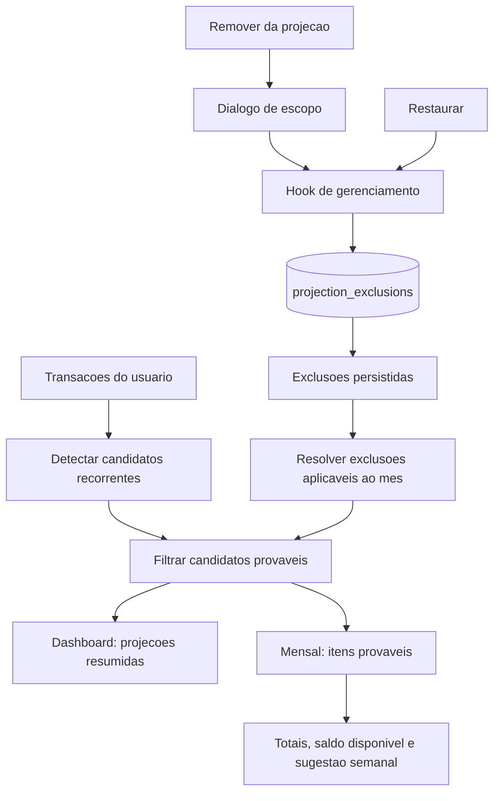

# Remover Estimativas Provaveis Da Projecao Design

**Spec**: `.specs/features/006-remover-estimativas-provaveis-da-projecao/spec.md`
**Status**: Approved

---

## Architecture Overview

A feature sera implementada como uma preferencia persistente do usuario, separada de `transactions`. A heuristica atual continuara gerando candidatos recorrentes a partir do historico; em seguida, um filtro puro removera os candidatos cobertos por uma exclusao antes da composicao de qualquer total projetado.

O mesmo conjunto filtrado alimentara:

- o resumo de projecoes da dashboard;
- o detalhe da pagina `Mensal`;
- os totais por grupo e categoria;
- o saldo disponivel e a sugestao semanal do mes atual.

Isso evita divergencia entre o resumo e o detalhe sem alterar transacoes registradas ou o historico que sustenta a heuristica.



### Boundary Rules

1. `transactions` permanece a fonte de verdade para eventos financeiros registrados.
2. `projection_exclusions` armazena somente preferencias sobre estimativas provaveis.
3. `buildRecurringCandidates` nao recebe exclusoes e nao muda seus criterios.
4. Exclusoes sao aplicadas depois da deteccao de recorrencias e antes de qualquer agregacao projetada.
5. A identidade funcional da recorrencia permanece `type + normalizedDescription`.
6. O banco garante isolamento por usuario; o frontend nao deve depender apenas de filtros locais para seguranca.

---

## Data Flow

### Initial Load

1. `useTransactionsData` carrega grupos, regras, transacoes e exclusoes do usuario autenticado.
2. Cada registro de exclusao passa por normalizacao explicita.
3. `useDashboardState` recebe `projectionExclusions` junto de grupos e transacoes.
4. `buildFinancialAnalysis` detecta os candidatos recorrentes.
5. Para cada mes calculado, o helper de matching decide se o candidato esta excluido.
6. A dashboard e a pagina mensal recebem resultados derivados do mesmo conjunto.

### Remove From Selected Month

1. O usuario aciona `Remover da projecao…` na linha provavel.
2. `ProjectionExclusionDialog` recebe o item selecionado e abre com duas opcoes de escopo.
3. O usuario escolhe `Somente neste mes` e confirma.
4. O hook adiciona uma exclusao otimista com `scope = 'month'` e `month_start` igual ao primeiro dia do mes selecionado.
5. A analise financeira e recalculada e a linha desaparece dos totais imediatamente.
6. O hook persiste a exclusao e substitui o ID temporario pelo ID retornado.
7. Em falha, o hook remove a exclusao temporaria, restaura a projecao e anuncia o erro.

### Remove From Selected Month Forward

O fluxo e o mesmo, usando `scope = 'from_month'`. A exclusao passa a corresponder a qualquer mes igual ou posterior a `month_start`.

### Restore

1. Um controle recolhido mostra `Ocultando X estimativa(s)`, contando recorrencias distintas afetadas no mes selecionado.
2. O usuario expande o controle para revisar as estimativas removidas.
3. O usuario aciona `Restaurar`.
4. O hook remove otimisticamente o registro pelo `id`.
5. A recorrencia volta a participar dos calculos se ainda for produzida pela heuristica.
6. Em falha, o hook reinsere o registro no estado e anuncia o erro.
7. Restaurar uma regra `from_month` remove o registro inteiro, inclusive quando a acao ocorre em um mes posterior ao inicio.

### Undo After Removal

Depois de uma remocao bem-sucedida, um feedback acionavel oferece `Desfazer`. A acao restaura exatamente a exclusao recem-criada. O feedback permanece ate a proxima mutacao de projecao ou saida da pagina, evitando um limite de tempo inacessivel.

---

## Code Reuse Analysis

### Existing Components To Leverage

| Component | Location | How to use |
| --- | --- | --- |
| `buildFinancialAnalysis` | `web/src/lib/financialAnalysis.ts` | Manter como ponto canonico dos calculos e adicionar exclusoes como entrada. |
| `MonthlyProjectionItems` | `web/src/components/MonthlyProjectionItems.tsx` | Adicionar acao somente nas linhas `Provavel` e a secao de itens removidos. |
| `MonthlyProjectionSummary` | `web/src/components/MonthlyProjectionSummary.tsx` | Nao muda contrato visual; recebe totais ja recalculados. |
| `MonthlyProjectionBreakdown` | `web/src/components/MonthlyProjectionBreakdown.tsx` | Nao muda contrato visual; recebe grupos e categorias ja recalculados. |
| `AppDialog` | `web/src/components/ui/AppDialog.tsx` | Fornecer foco, portal, overlay, Escape e retorno de foco via Radix Dialog. |
| Hooks de gerenciamento | `web/src/hooks/useClassificationRuleManagement.ts` e `useBudgetGroupManagement.ts` | Reutilizar padroes de estado de salvamento, normalizacao, feedback e Supabase direto. |
| `useTransactionsData` | `web/src/hooks/useTransactionsData.ts` | Carregar exclusoes junto aos demais dados autenticados. |
| URL mensal | `web/src/App.tsx` | Preservar `?month=YYYY-MM` e usar `removed=expanded` para o painel aberto. |
| Estilos de feedback e spinner | `web/src/App.css` e `web/src/styles/components.css` | Reutilizar feedback, botoes, foco e loading existentes. |
| Helpers E2E Supabase | `web/e2e/helpers/supabase.ts` | Adicionar seed e consulta de exclusoes para testes persistentes. |

### Integration Points

| System | Integration method |
| --- | --- |
| Supabase Auth | `user_id` obtido do usuario autenticado ao inserir; RLS valida propriedade. |
| Supabase Postgres | Nova tabela `public.projection_exclusions`. |
| Dashboard | `buildOverview` ignora candidatos cobertos por exclusoes. |
| Pagina Mensal | `buildMonthlyProjectionInsight` ignora candidatos e produz a lista de exclusoes aplicaveis. |
| Feedback global | Erros continuam em `setError`; sucesso simples usa `setFeedback`. |
| Feedback acionavel | Estado local do hook expoe a ultima exclusao criada para `Desfazer`. |

---

## Data Model

### Database Table

Migration proposta:

`supabase/migrations/20260611120000_create_projection_exclusions.sql`

```sql
create table if not exists public.projection_exclusions (
  id uuid primary key default gen_random_uuid(),
  user_id uuid not null references auth.users(id) on delete cascade,
  type text not null check (type in ('Despesa', 'Receita')),
  description text not null check (length(trim(description)) > 0),
  normalized_description text not null check (length(trim(normalized_description)) > 0),
  scope text not null check (scope in ('month', 'from_month')),
  month_start date not null,
  created_at timestamptz not null default timezone('utc'::text, now()),
  updated_at timestamptz not null default timezone('utc'::text, now()),
  constraint projection_exclusions_month_start_check
    check (month_start = date_trunc('month', month_start)::date),
  constraint projection_exclusions_unique
    unique (user_id, type, normalized_description, scope, month_start)
);
```

Indices:

```sql
create index if not exists projection_exclusions_user_month_idx
on public.projection_exclusions (user_id, month_start);

create index if not exists projection_exclusions_user_identity_idx
on public.projection_exclusions (user_id, type, normalized_description);
```

O primeiro indice atende a carga e a verificacao temporal. O segundo atende reconciliacao, diagnostico e futuras operacoes por recorrencia.

### Why `date` Instead Of `YYYY-MM` Text

- Postgres valida datas reais.
- A constraint garante o primeiro dia do mes.
- Comparacoes de escopo futuro usam operadores temporais nativos.
- O frontend converte `YYYY-MM` para `YYYY-MM-01` somente na borda de persistencia.

### Why Store Both Descriptions

- `normalized_description` e a chave de matching estavel.
- `description` e um snapshot legivel para revisar e restaurar a exclusao mesmo quando a heuristica deixar de produzir o candidato.
- Mudancas futuras na apresentacao nao precisam reconstruir texto a partir de uma chave normalizada.

### RLS

Politicas obrigatorias:

```sql
alter table public.projection_exclusions enable row level security;

create policy "projection_exclusions_select_own"
on public.projection_exclusions
for select to authenticated
using (auth.uid() = user_id);

create policy "projection_exclusions_insert_own"
on public.projection_exclusions
for insert to authenticated
with check (auth.uid() = user_id);

create policy "projection_exclusions_update_own"
on public.projection_exclusions
for update to authenticated
using (auth.uid() = user_id)
with check (auth.uid() = user_id);

create policy "projection_exclusions_delete_own"
on public.projection_exclusions
for delete to authenticated
using (auth.uid() = user_id);
```

Um trigger `set_projection_exclusions_updated_at` reutiliza `public.set_updated_at()`.

### TypeScript Contracts

Adicionar em `web/src/types.ts`:

```typescript
export type ProjectionExclusionScope = 'month' | 'from_month'

export type ProjectionExclusion = {
  id: string
  type: Exclude<TransactionType, 'Transferência'>
  description: string
  normalizedDescription: string
  scope: ProjectionExclusionScope
  monthStart: string
  createdAt: string
}

export type ProjectionExclusionRecord = {
  id: string
  type: Exclude<TransactionType, 'Transferência'> | null
  description: string | null
  normalized_description: string | null
  scope: ProjectionExclusionScope | null
  month_start: string | null
  created_at: string | null
}

export type ProjectionExclusionPayload = {
  type: Exclude<TransactionType, 'Transferência'>
  description: string
  normalizedDescription: string
  scope: ProjectionExclusionScope
  monthKey: string
}

export type RemovedProjectionItem = {
  exclusion: ProjectionExclusion
  currentEstimate: ProjectionLineItem | null
}
```

Adicionar a `MonthlyProjectionInsight`:

```typescript
removedProbableItems: RemovedProjectionItem[]
```

`currentEstimate` fica `null` quando a exclusao existe, mas a heuristica nao gera mais aquela recorrencia. Quando houver candidato, permite mostrar valor medio, data estimada e base atual sem persistir dados derivados.

---

## Matching And Calculation Rules

### Shared Identity

Extrair ou exportar a normalizacao usada hoje em `financialAnalysis.ts` como um helper compartilhado:

```typescript
normalizeProjectionDescription(description: string | null | undefined): string
```

Todos os pontos de criacao e matching devem usar exatamente essa funcao. Nao deve existir uma segunda implementacao de remocao de acentos, caixa ou espacos.

### Scope Matching

Helper puro proposto em `web/src/lib/projectionExclusions.ts`:

```typescript
function appliesToProjectionMonth(
  exclusion: ProjectionExclusion,
  monthKey: string,
): boolean
```

Regras:

```text
scope = month      -> monthKey === exclusion.monthStart.slice(0, 7)
scope = from_month -> monthKey >= exclusion.monthStart.slice(0, 7)
```

O match completo tambem exige:

```text
candidate.type === exclusion.type
candidate.normalizedDescription === exclusion.normalizedDescription
```

### Calculation Order

Ordem obrigatoria:

1. validar e resumir transacoes registradas;
2. detectar candidatos recorrentes usando historico sem exclusoes;
3. suprimir candidato quando ja existe transacao persistida no mes;
4. suprimir candidato quando existe exclusao aplicavel;
5. aplicar regra de data esperada do mes atual;
6. montar itens provaveis;
7. calcular totais, grupos, categorias, saldo e sugestao semanal.

Essa ordem garante que:

- exclusoes nao contaminem a heuristica;
- um lancamento registrado continue prevalecendo sobre uma estimativa;
- itens cuja data esperada ja passou nao reaparecam;
- todos os indicadores usem o mesmo conjunto final.

### Dashboard Consistency

`buildOverview` recebera `projectionExclusions` e verificara cada par candidato/mes antes de somar receita ou despesa provavel.

Embora a dashboard atual separe explicitamente apenas despesas provaveis, uma receita provavel removida tambem deve deixar de compor `revenue` e `net`.

### Removed Items Derivation

Para o mes ativo:

1. selecionar exclusoes aplicaveis ao mes;
2. localizar candidato atual com mesma identidade;
3. quando houver candidato, construir um `ProjectionLineItem` derivado para `currentEstimate`;
4. quando nao houver, manter somente o snapshot da exclusao;
5. ordenar por descricao, tipo, escopo e mes inicial.

Exclusoes sobrepostas podem coexistir. Elas ocultam o candidato uma unica vez e sao agrupadas pela identidade da recorrencia para o contador. No painel expandido, cada regra continua identificada pelo proprio alcance porque restaurar uma delas nao necessariamente torna o candidato visivel.

---

## Components And Interfaces

### Projection Exclusion Utilities

- **Location**: `web/src/lib/projectionExclusions.ts`
- **Purpose**: normalizar registros, construir payloads e resolver matching sem React ou Supabase.
- **Interfaces**:

```typescript
normalizeProjectionExclusion(record: ProjectionExclusionRecord): ProjectionExclusion
toProjectionMonthStart(monthKey: string): string
appliesToProjectionMonth(exclusion: ProjectionExclusion, monthKey: string): boolean
isCandidateExcluded(candidate: RecurringCandidate, monthKey: string, exclusions: ProjectionExclusion[]): boolean
```

- **Dependencies**: tipos e comparação de month keys.
- **Reuses**: normalizacao canonica de descricao e helpers de mes.

### `buildFinancialAnalysis`

- **Location**: `web/src/lib/financialAnalysis.ts`
- **Purpose**: continuar como regra canonica de projecao.
- **New interface**:

```typescript
buildFinancialAnalysis(
  transactions: Transaction[],
  budgetGroups: BudgetGroup[],
  projectionExclusions: ProjectionExclusion[],
  activeMonth: string,
  now?: Date,
): FinancialAnalysis
```

- **Changes**:
  - passar exclusoes a `buildOverview`;
  - filtrar em `buildProbableItems`;
  - derivar `removedProbableItems`;
  - manter candidatos independentes das exclusoes.

### `useTransactionsData`

- **Location**: `web/src/hooks/useTransactionsData.ts`
- **Purpose**: carregar o estado persistido inicial.
- **Changes**:
  - estado `projectionExclusions`;
  - query de `projection_exclusions`;
  - normalizacao dos registros;
  - retorno de `setProjectionExclusions`;
  - limpeza no logout pelo mesmo fluxo que limpa os demais dados.

Query:

```typescript
.from('projection_exclusions')
.select('id, type, description, normalized_description, scope, month_start, created_at')
.order('created_at', { ascending: false })
```

### `useProjectionExclusionManagement`

- **Location**: `web/src/hooks/useProjectionExclusionManagement.ts`
- **Purpose**: concentrar insercao, restauracao, rollback e desfazer.
- **State**:
  - `savingProjectionExclusionId: string`;
  - `lastCreatedProjectionExclusion: ProjectionExclusion | null`.
- **Interfaces**:

```typescript
createProjectionExclusion(payload: ProjectionExclusionPayload): Promise<boolean>
restoreProjectionExclusion(id: string): Promise<boolean>
undoLastProjectionExclusion(): Promise<boolean>
clearProjectionExclusionUndo(): void
```

#### Optimistic Insert

1. criar ID temporario `optimistic:{crypto.randomUUID()}`;
2. inserir no estado;
3. executar `insert(...).select(...).single()`;
4. substituir temporario pelo registro normalizado;
5. em falha, remover temporario e restaurar feedback de erro.

Se o banco retornar violacao de unicidade, o hook deve reconciliar com o registro existente em vez de duplicar estado. A UI pode tratar a recorrencia como ja removida e informar isso sem quebrar a projecao.

#### Optimistic Restore

1. capturar o registro completo;
2. remover do estado;
3. executar `delete().eq('id', id)`;
4. em falha, reinserir o snapshot e anunciar erro.

### `ProjectionExclusionDialog`

- **Location**: `web/src/components/ProjectionExclusionDialog.tsx`
- **Purpose**: confirmar qual alcance a remocao tera.
- **Reuses**: `AppDialog`.
- **Props**:

```typescript
type ProjectionExclusionDialogProps = {
  item: ProjectionLineItem | null
  monthKey: string
  saving: boolean
  onClose: () => void
  onConfirm: (scope: ProjectionExclusionScope) => Promise<void> | void
}
```

### Dialog Content

- titulo: `Remover estimativa da projeção`;
- descricao com nome e valor medio da estimativa;
- `fieldset` com `legend` explicando o alcance;
- radio `Somente neste mês`;
- radio `Neste e nos meses futuros`;
- texto auxiliar em cada opcao;
- botoes `Cancelar` e `Remover da projeção`;
- opcao padrao: `Somente neste mês`, por ser o efeito menos abrangente.

O botao de confirmacao permanece habilitado ate o inicio da requisicao. Durante a requisicao, mantem o rotulo e inclui spinner.

### Focus Behavior

`AppDialog`/Radix fornece:

- foco inicial dentro do dialogo;
- trap de foco;
- fechamento por Escape;
- retorno ao acionador.

O primeiro radio deve receber foco inicial, nao o botao destrutivo.

### `MonthlyProjectionItems`

- **Location**: `web/src/components/MonthlyProjectionItems.tsx`
- **Purpose**: apresentar itens registrados, provaveis e removidos.
- **New props**:

```typescript
type MonthlyProjectionItemsProps = {
  insight: MonthlyProjectionInsight
  onRemoveProbableItem: (item: ProjectionLineItem) => void
  onRestoreExclusion: (id: string) => void
  savingProjectionExclusionId: string
}
```

#### Probable Table

Adicionar coluna `Ações` somente a tabela provavel. Cada linha recebe botao textual `Remover da projeção…`.

Nome acessivel completo:

```text
Remover [descricao] da projeção
```

O botao deve ter pelo menos 44px em viewport movel, foco visivel e `touch-action: manipulation`.

#### Removed Disclosure

O controle aparece depois de `Estimativas prováveis` apenas quando `removedProbableItems.length > 0`. Por padrao, a lista permanece recolhida e exibe somente:

```text
Ocultando 1 estimativa
Ocultando 3 estimativas
```

O controle deve ser um `button` com:

- `aria-expanded`;
- `aria-controls` apontando para o painel;
- indicador visual textual ou icone com nome decorativo;
- alvo minimo de 44px em viewport movel;
- foco visivel.

Quando expandido, o painel mostra por recorrencia:

- descricao snapshot;
- tipo `Receita` ou `Despesa`;
- valor medio atual, quando houver candidato;
- `Somente em <mes>` para escopo mensal;
- `Desde <mes>` para escopo futuro;
- indicacao `A recorrência não está mais sendo estimada` quando `currentEstimate` for nulo;
- botao `Restaurar`.

Para exclusoes sobrepostas, uma recorrencia conta uma unica vez no informativo, mas o painel mostra cada regra aplicavel com seu proprio alcance, mes inicial e acao `Restaurar`.

### `MonthlyView`

- **Location**: `web/src/components/MonthlyView.tsx`
- **Purpose**: coordenar dialogo, feedback acionavel e componentes da pagina.
- **Local UI state**:

```typescript
selectedProbableItem: ProjectionLineItem | null
removedPanelExpanded: boolean
```

- **New props**:
  - criacao de exclusao;
  - restauracao;
  - desfazer;
  - estado de salvamento;
  - ultima exclusao criada.

O dialogo pode ser renderizado dentro de `MonthlyView`, pois a selecao pertence exclusivamente a essa pagina e o portal do Radix evita problemas de stacking.

O estado `removedPanelExpanded` e inicializado a partir de `removed=expanded`. Ao expandir ou recolher, `MonthlyView` solicita a atualizacao da query string sem perder `month`. O listener de `popstate` restaura ambos os estados.

### `useDashboardState`

- **Location**: `web/src/hooks/useDashboardState.ts`
- **Purpose**: conectar exclusoes ao calculo derivado.
- **Change**: adicionar `projectionExclusions` como argumento e repassar a `buildFinancialAnalysis`.

### `App`

- **Location**: `web/src/App.tsx`
- **Purpose**: somente compor os hooks e propagar contratos.
- **Changes**:
  - receber exclusoes de `useTransactionsData`;
  - inicializar `useProjectionExclusionManagement`;
  - passar exclusoes a `useDashboardState`;
  - passar handlers e estados a `MonthlyView`;
  - limpar exclusoes e undo no logout.

Nenhuma regra de matching deve ser implementada em `App.tsx`.

---

## UX And Visual Design

### Placement

A acao fica na propria linha provavel, no ponto onde o usuario avalia a estimativa. Nao sera colocada nos resumos agregados, porque remover um agregado nao identifica qual recorrencia deve ser excluida.

As estimativas removidas usam divulgacao progressiva: o estado padrao ocupa uma unica linha informativa e os detalhes aparecem somente sob demanda. Isso mantem o foco nas estimativas ativas sem esconder a existencia das exclusoes.

### Destructive Semantics

Apesar de reversivel, a acao altera indicadores financeiros. Por isso:

- usa confirmacao obrigatoria;
- explica os dois alcances antes de persistir;
- oferece restauracao permanente;
- oferece desfazer imediato;
- nao usa apenas icone ou cor para indicar efeito.

### Desktop

- tabela mantem colunas atuais e adiciona `Ações`;
- botao e textual, com estilo `ghost danger-subtle`;
- secao removida usa painel interno de menor contraste para nao competir com estimativas ativas;
- valores usam numeros tabulares.

### Mobile

- manter wrapper horizontal da tabela como fallback;
- garantir que a coluna de acao nao fique com alvo menor que 44px;
- dialogo ocupa largura disponivel respeitando safe areas;
- radios usam label inteira como alvo clicavel;
- textos longos usam `overflow-wrap: anywhere`/`break-words`;
- nenhum controle depende de hover.

### Loading And Feedback

- linha em mutacao mantem conteudo para evitar layout shift;
- botao mostra spinner e texto original;
- demais linhas permanecem operaveis, exceto quando conflitarem com a mesma recorrencia;
- erro usa `role="alert"`;
- sucesso e desfazer usam regiao `aria-live="polite"`;
- skeleton inicial deve incluir largura equivalente a nova coluna para evitar mudanca perceptivel.

### Empty States

| State | Copy |
| --- | --- |
| Nenhuma estimativa ativa e nenhuma removida | `Nenhuma recorrência provável identificada.` |
| Nenhuma estimativa ativa, mas existem removidas | Manter vazio da secao ativa e mostrar `Ocultando X estimativa(s)`. |
| Exclusao sem candidato atual | `A recorrência não está mais sendo estimada.` |
| Falha de carga | Feedback de erro existente e proximo passo via recarregamento da pagina. |

---

## Error Handling Strategy

| Error scenario | Handling | User impact |
| --- | --- | --- |
| Falha ao carregar exclusoes | Interromper load autenticado como ocorre com outras fontes. | Mensagem de erro; nenhuma projecao potencialmente inconsistente e exibida como definitiva. |
| Usuario sem sessao ao criar | Abortar antes da query. | `Usuário não autenticado.` em alerta. |
| Falha no insert | Remover exclusao otimista. | Item e totais voltam ao estado anterior; erro anunciado. |
| Violacao de unicidade | Consultar/reconciliar registro existente. | Item permanece removido sem duplicacao. |
| Falha no delete/restauracao | Recolocar exclusao no estado. | Item continua removido; erro anunciado. |
| Exclusao de outro usuario | RLS bloqueia. | Operacao falha sem vazamento de dados. |
| Registro invalido retornado | Normalizador aplica defaults seguros ou lanca erro de contrato durante load. | Evita matching silenciosamente incorreto. |
| Candidato deixa de existir | Manter exclusao na secao com snapshot. | Usuario ainda consegue restaurar/limpar a preferencia. |
| Duas exclusoes aplicaveis | Matching usa `some`, sem dupla subtracao. | Item some uma vez; regras continuam gerenciaveis individualmente. |

---

## Testing Strategy

### Unit: Projection Exclusion Helpers

Arquivo: `web/src/lib/projectionExclusions.test.ts`

Casos:

- normaliza record Supabase;
- converte `YYYY-MM` para primeiro dia;
- escopo mensal corresponde apenas ao mes exato;
- escopo futuro corresponde ao mes inicial e posteriores;
- futuro nao afeta meses anteriores;
- descricao normalizada e tipo participam do match;
- receita e despesa com mesma descricao nao colidem;
- lista vazia nao exclui candidato.

### Unit: Financial Analysis

Arquivo: `web/src/lib/financialAnalysis.test.ts`

Casos:

- exclusao mensal remove item somente do detalhe daquele mes;
- exclusao futura remove do mes inicial e seguintes;
- dashboard de tres meses respeita exclusoes;
- mes anterior ao inicio continua projetando;
- receita provavel removida atualiza receita e saldo;
- despesa provavel removida atualiza despesa, grupo e categoria;
- saldo disponivel e sugestao semanal sao recalculados;
- candidato continua sendo detectado mesmo excluido;
- duas exclusoes aplicaveis nao subtraem duas vezes;
- removido com candidato gera `currentEstimate`;
- removido sem candidato permanece listado com `currentEstimate = null`.

### Hook Tests

Arquivo: `web/src/hooks/useProjectionExclusionManagement.test.tsx`

Casos:

- insert otimista e reconciliacao com resposta;
- rollback em falha de insert;
- delete otimista;
- rollback em falha de delete;
- desfazer remove a ultima exclusao criada;
- estado de saving impede submit duplicado;
- conflito de unicidade reconcilia sem duplicar.

### Component Tests

Arquivos:

- `web/src/components/ProjectionExclusionDialog.test.tsx`;
- `web/src/components/MonthlyProjectionItems.test.tsx`.

Casos:

- somente linhas provaveis possuem acao;
- nome acessivel inclui descricao;
- dialogo inicia em `Somente neste mês`;
- cancelar nao chama mutacao;
- confirmar envia o escopo escolhido;
- loading preserva rotulo e exibe spinner;
- secao removida mostra escopo, mes, tipo e valor;
- informativo inicia recolhido e mostra a contagem de recorrencias distintas;
- clique e teclado alternam `aria-expanded` e a visibilidade do painel;
- estado expandido e restaurado por `removed=expanded`, Voltar e Avancar;
- item sem candidato mostra texto explicativo;
- restaurar chama ID correto;
- foco retorna ao acionador ao fechar.

### Database Validation

- migration aplica em banco local limpo;
- constraints rejeitam `Transferência`;
- constraints rejeitam mes que nao seja primeiro dia;
- unique rejeita duplicata equivalente;
- RLS permite CRUD do proprio usuario;
- RLS bloqueia leitura e mutacao entre dois usuarios.

### E2E: Playwright

Arquivo: `web/e2e/monthly-projection-exclusions.spec.ts`

Fluxos:

1. remover somente no mes e confirmar que o mes seguinte ainda mostra a estimativa;
2. remover a partir do mes e confirmar ausencia no mes atual e seguinte;
3. confirmar que a dashboard tambem recalcula o resumo;
4. recarregar deep link e confirmar persistencia;
5. restaurar exclusao mensal;
6. restaurar exclusao futura a partir de mes posterior;
7. validar recálculo do saldo disponivel e sugestao semanal;
8. expandir `Ocultando X estimativa(s)` e validar a contagem;
9. recarregar e navegar com Voltar/Avancar preservando o painel expandido;
10. navegar e executar dialogo por teclado;
11. validar layout/controles principais em viewport movel;
12. validar rollback visivel com falha de rede interceptada.

Adicionar em `web/e2e/helpers/supabase.ts`:

```typescript
seedProjectionExclusion(...)
fetchProjectionExclusions(...)
```

### Full Gate

```bash
cd web
npm run test
npm run lint
npm run typecheck
npm run build
npm run test:e2e
```

Para a migration:

```bash
supabase db reset
```

ou aplicar a migration na stack local equivalente antes do Playwright.

---

## Requirement Mapping

| Requirements | Design elements |
| --- | --- |
| PEXC-01, PEXC-02, PEXC-06 | Acao na linha e `ProjectionExclusionDialog`. |
| PEXC-03, PEXC-07, PEXC-08, PEXC-09 | Matching por escopo aplicado depois da heuristica. |
| PEXC-04, PEXC-05, PEXC-16 | Estado otimista e recalculo por `buildFinancialAnalysis`. |
| PEXC-10 | Identidade inclui `type`. |
| PEXC-11 | Tabela persistente carregada no inicio. |
| PEXC-12, PEXC-13, PEXC-24 | Controle `Ocultando X estimativa(s)` e painel expansivel com regras agrupadas. |
| PEXC-14, PEXC-15 | Delete da exclusao mensal ou futura pelo ID original. |
| PEXC-17 | Rollback e regioes live. |
| PEXC-18 | Feedback acionavel `Desfazer`. |
| PEXC-19 | `AppDialog` com foco gerenciado. |
| PEXC-20 | Loading com rotulo preservado e spinner. |
| PEXC-21, PEXC-22 | Controles semanticos, foco visivel e alvo movel de 44px. |
| PEXC-23, PEXC-25 | Carga independente e estado expandido via `month` + `removed=expanded`. |

**Coverage:** 25 de 25 requisitos cobertos pelo design.

---

## Tech Decisions

| Decision | Choice | Rationale |
| --- | --- | --- |
| Persistencia | Tabela separada `projection_exclusions` | Nao mistura preferencia de projecao com evento financeiro real. |
| Identidade | Tipo + descricao normalizada | Reutiliza exatamente a identidade da heuristica atual. |
| Temporalidade | `month_start` como primeiro dia + `scope` | Permite comparacao simples e dois alcances explicitos. |
| Filtro | Depois da deteccao, antes da agregacao | Preserva historico e mantem todos os totais consistentes. |
| Dashboard | Aplicar as mesmas exclusoes | Evita resumo divergente do detalhe. |
| Restauracao | Delete fisico da preferencia | O registro nao possui valor historico apos restaurado e a reversao fica simples. |
| UI | Acao contextual por linha + dialogo de radios + painel recolhido | Torna o alvo e o alcance inequivocos sem poluir o detalhamento ativo. |
| Mutacoes | Otimistas com rollback | Mantem resposta imediata sem deixar estado incorreto em falha. |
| Desfazer | Sem expiracao automatica | Evita pressao temporal e problemas de acessibilidade. |
| Exclusoes sobrepostas | Permitidas e listadas separadamente | Preserva intencoes distintas e evita mutacoes implicitas em outras regras. |

---

## Risks And Mitigations

| Risk | Mitigation |
| --- | --- |
| Divergencia entre dashboard e mensal | Um unico `buildFinancialAnalysis` recebe exclusoes e alimenta ambas. |
| Normalizacao duplicada | Helper canonico compartilhado e testes de acentos/espacos/caixa. |
| Crescimento do `App.tsx` | Logica assinc fica em hook dedicado; App apenas compoe. |
| Estado otimista inconsistente | Snapshot e rollback para insert/delete; teste de falha. |
| Regra futura removida por engano | Confirmacao, alcance textual, secao persistente e desfazer. |
| Dados de outro usuario | RLS em todas as operacoes e testes com dois usuarios. |
| Exclusao obsoleta invisivel | Snapshot de descricao permite continuar exibindo e restaurando. |
| Tabela larga no mobile | Wrapper responsivo existente, coluna compacta e alvo minimo de 44px. |
| Lista de exclusoes crescer | Dataset esperado e pequeno; indice por usuario/mes. Reavaliar paginacao apenas com evidencia. |

---

## Alternatives Rejected

### Add `excluded_from_projection` To `transactions`

Rejeitado porque o item provavel nao e uma transacao persistida. Marcar transacoes historicas tambem alteraria indevidamente a base da heuristica.

### Persist The Full Projected Item

Rejeitado porque valor, categoria, grupo e data esperada sao derivados e podem mudar com novo historico. Persistir somente identidade, escopo e snapshot de descricao evita dados projetados obsoletos.

### Store Only In Browser

Rejeitado porque exclusoes precisam sobreviver a reload, funcionar entre dispositivos e respeitar usuario autenticado.

### Filter Only In `MonthlyProjectionItems`

Rejeitado porque esconderia a linha sem corrigir totais, saldo, sugestao semanal e dashboard.

### One Global “Never Project Again” Flag

Rejeitado porque nao cobre a excecao pontual por mes e torna a decisao mais abrangente do que o usuario solicitou.
