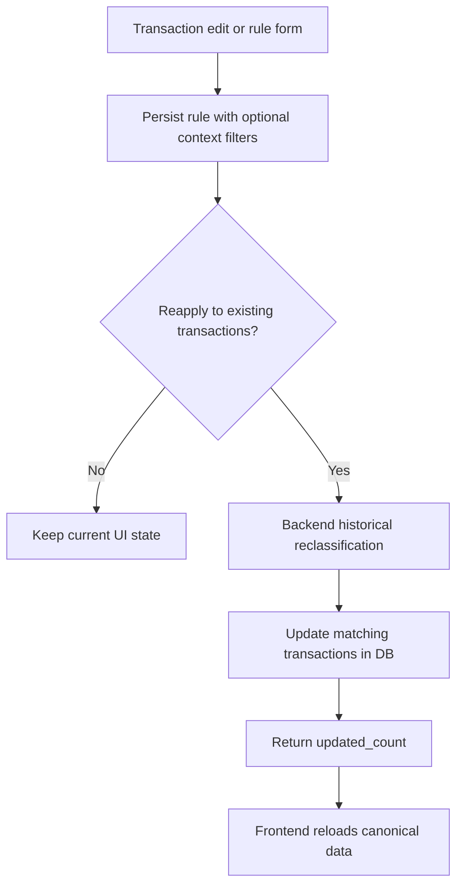

# Reclassificar Historico E Refinar Match Design

**Spec**: `.specs/features/007-reclassificar-historico-e-refinar-match/spec.md`
**Context**: `.specs/features/007-reclassificar-historico-e-refinar-match/context.md`
**Status**: Draft

---

## Architecture Overview

A feature promove a reaplicacao de regras para uma operacao canonica do backend e expande o contrato de match das regras persistidas.

Contrato proposto:

1. regra do usuario continua sendo persistida em `transaction_classification_rules`
2. a regra passa a poder carregar filtros opcionais de `match_institution` e `match_account`
3. o frontend cria/edita a regra com esses filtros e, se solicitado, aciona uma operacao server-side de reclassificacao historica
4. o backend localiza todas as transacoes do usuario que satisfazem o contrato de match e atualiza apenas `type`, `category` e `budget_group_id`
5. o frontend recarrega `transactions` e `transaction_classification_rules` a partir do banco

Regra principal de matching:

- descricao normalizada sempre precisa combinar
- `description_amount` continua exigindo valor exato
- `match_institution`, quando preenchido, precisa ser igual a `transactions.institution`
- `match_account`, quando preenchido, precisa ser igual a `transactions.account`



## Code Reuse Analysis

### Existing Components to Leverage

| Component | Location | How to Use |
| --------- | -------- | ---------- |
| `useClassificationRuleManagement()` | `web/src/hooks/useClassificationRuleManagement.ts` | Manter CRUD e trocar a reclassificacao local por chamada canonica ao backend |
| `normalizeRuleDescription()` | `web/src/lib/transactions.ts`, `supabase/functions/_shared/classification-rules.ts` | Preservar a normalizacao atual, estendendo apenas o contrato de filtros |
| `loadUserClassificationRules()` | `supabase/functions/_shared/classification-rules.ts` | Expandir o shape da regra com filtros extras |
| pagina de regras | `web/src/components/ClassificationRulesPage.tsx` e adjacencias | Exibir e editar filtros de contexto |
| `useTransactionsData()` | `web/src/hooks/useTransactionsData.ts` | Recarregar estado canonico apos a operacao em lote |

### Integration Points

| System | Integration Method |
| ------ | ------------------ |
| Supabase database | migration para colunas extras da regra e suporte ao update em lote |
| Frontend React | formulario de regra com filtros extras e troca do fluxo local por reload canonico |
| Edge Function + shared matcher | criterio refinado para futuras importacoes e reaplicacao historica |
| Testing | unit para matcher e hook, E2E para contagem e cobertura de historico fora da tela |

---

## Components

### Extended rule schema

- **Purpose**: Persistir filtros extras que definem melhor o enquadramento da transacao.
- **Location**: nova migration em `supabase/migrations/`
- **New fields**:
  - `match_institution text null`
  - `match_account text null`
- **Constraints**:
  - valores vazios devem ser normalizados para `null`
  - campos extras nao mudam a compatibilidade das regras atuais

### Backend historical reclassification endpoint

- **Purpose**: Atualizar todas as transacoes elegiveis do usuario diretamente no banco e devolver `updated_count`.
- **Location**: nova Edge Function em `supabase/functions/`
- **Interface**:
  - input: `rule_id uuid`
  - auth: usuario autenticado, limitado por `auth.uid()`
  - output: `{ updated_count: number }`
- **Behavior**:
  - carregar a regra do usuario
  - compor um filtro forte no banco por `user_id`, descricao, modo de match, valor quando aplicavel, `institution` e `account` quando preenchidos
  - atualizar apenas `type`, `category` e `budget_group_id` nas linhas cujo snapshot mudaria
  - retornar contagem de atualizadas

Estrategias aceitaveis dentro da Edge Function:

1. `update` em lote direto com filtros suficientes para o match
2. `select` de um conjunto pequeno de candidatas prefiltradas + `update` em lote por ids

Preferencia inicial: fazer `update` em lote direto a partir da Edge Function, porque evita carregar o historico inteiro do usuario e usa o banco para o trabalho pesado de selecao.

Fallback aceitavel: se a query de match completo ficar opaca demais, a Edge Function pode prefiltrar candidatas no banco e usar TypeScript apenas para desempate ou refinamento final. O fallback nao pode fazer varredura completa do historico.

### Shared match contract

- **Purpose**: Manter alinhamento entre importacao futura e reaplicacao historica.
- **Location**: `supabase/functions/_shared/classification-rules.ts`, `web/src/lib/transactions.ts`, nova Edge Function de reclassificacao
- **Interfaces**:
  - expandir `UserClassificationRule` e `ClassificationRule`
  - comparar `institution` e `account` quando a regra trouxer esses campos
- **Risk control**:
  - adicionar testes de contrato cobrindo os mesmos cenarios nas duas implementacoes
  - limitar a duplicacao de logica SQL ao minimo necessario para o filtro em lote

### Rule management UI updates

- **Purpose**: Permitir configurar e enxergar os filtros extras da regra.
- **Location**: pagina e formularios de regras, prompt de aprendizado e feedback de reaplicacao
- **Behavior**:
  - exibir `institution` e `account` quando vierem da transacao-base
  - permitir editar/remover esses filtros na tela de regras
  - manter labels e copy explicando o impacto no historico persistido

---

## Data Models

### ClassificationRule

```ts
type ClassificationRule = {
  id: string
  matchMode: 'description' | 'description_amount'
  matchDescription: string
  matchDescriptionNormalized: string
  matchAmount: number | null
  matchInstitution: string | null
  matchAccount: string | null
  type: TransactionType
  category: string
  budgetGroupId: string | null
  updatedAt?: string
}
```

### Backend result

```ts
type HistoricalReclassificationResult = {
  updated_count: number
}
```

## Schema Design

### Table changes

`public.transaction_classification_rules`

- add `match_institution text null`
- add `match_account text null`
- add supporting index on `(user_id, match_description_normalized, match_institution, match_account)`

Regras atuais permanecem validas com os novos campos nulos.

### Backend operation

Preferencia de design: Edge Function `reclassify-transactions-by-rule`

Razoes:

- mantem a regra de negocio fora de functions SQL do banco
- permite reaproveitar o matcher TypeScript ja usado nas importacoes
- continua operando sobre o historico inteiro do usuario, sem depender da pagina atual da UI
- ainda permite consolidar o write em lote no banco

Forma preferida de execucao:

1. carregar regra e transacoes candidatas do usuario no servidor
2. disparar uma operacao de update em lote no banco usando os filtros da regra
3. devolver `updated_count`

Forma alternativa aceitavel:

1. carregar a regra
2. prefiltrar candidatas no banco para um conjunto pequeno
3. aplicar refinamento final no runtime da Edge Function
4. enviar um update em lote apenas para os ids cujo snapshot mudaria
4. devolver `updated_count`

## Testing Strategy

- Unit: matcher puro no frontend cobrindo filtros extras e desempate
- Unit/integration: matcher compartilhado do backend e Edge Function cobrindo filtros extras e contagem de linhas afetadas
- Hook/component: `useClassificationRuleManagement` validando chamada ao backend, reload e feedback
- E2E: criar regra, reaplicar, confirmar efeito sobre transacoes nao visiveis na tabela e sobre contas diferentes
- Database: revisar migration, RLS e semantica do update em lote disparado pela Edge Function
