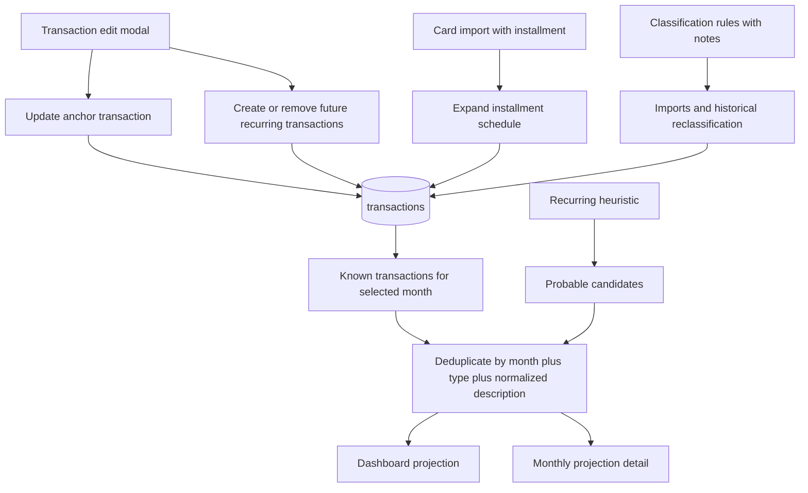

# Marcar Transacao Recorrente Ate Data Limite Design

**Spec**: `.specs/features/008-marcar-transacao-recorrente-ate-data-limite/spec.md`
**Status**: Draft

---

## Architecture Overview

A feature passa a usar um modelo unico para compromissos futuros conhecidos: eles sao persistidos em `transactions`.

Isso vale para:

1. parcelas importadas do cartao
2. recorrencias manuais criadas a partir de uma transacao existente
3. transacoes manuais criadas diretamente em qualquer mes

A unificacao vem por uma nova coluna em `transactions` que liga as linhas derivadas a uma transacao principal:

- `origin_transaction_id uuid null references public.transactions(id)`

Semantica:

- `origin_transaction_id is null`: transacao principal, independente ou nao derivada
- `origin_transaction_id = <id>`: transacao futura derivada da principal `<id>`

O resultado e um pipeline de projecao muito mais simples:

1. `transactions` passa a conter os compromissos futuros conhecidos
2. a projecao usa `transactions` como base conhecida unica
3. a heuristica de recorrencia continua produzindo `provavel`
4. `provavel` so entra quando nao existir transacao conhecida equivalente
5. transacoes conhecidas podem ser excluidas ou marcadas como ignoradas

Regra canonica de precedencia:

1. transacao conhecida em `transactions`
2. estimativa `provavel`

Origem dentro de transacao conhecida:

- `manual_recurring`
- `imported_installment`
- `manual`
- outras futuras extensoes



### Boundary Rules

1. Recorrencia manual gera linhas futuras reais em `transactions`.
2. Parcelamento importado continua gerando linhas futuras reais em `transactions`.
3. O agrupamento entre principal e derivadas usa `origin_transaction_id`.
4. A linha principal nao aponta para si mesma; apenas as derivadas apontam para a principal.
5. `notes` de regra nunca sobrescreve `transactions.notes` quando a transacao ja possui nota nao vazia.
6. Ignorar uma transacao a remove dos calculos, mas nao do banco.
7. Recorrencia manual nunca gera filha no mesmo mes da transacao principal; a serie começa no mes seguinte.

---

## Code Reuse Analysis

### Existing Components to Leverage

| Component | Location | How to use |
| --- | --- | --- |
| `TransactionEditModal` | `web/src/components/TransactionEditModal.tsx` | Estender com `Notas`, toggle de recorrencia e mes limite |
| `useTransactionEditing` | `web/src/hooks/useTransactionEditing.ts` | Evoluir para atualizar a transacao principal e sincronizar as derivadas futuras |
| `useTransactionsData` | `web/src/hooks/useTransactionsData.ts` | Carregar as novas colunas `origin_transaction_id`, `is_ignored` e, se adotado, `source_kind` |
| `TransactionTable` e `MonthlyView` | `web/src/components/TransactionTable.tsx`, `web/src/components/MonthlyView.tsx` | Expor acoes de criar, excluir e ignorar no fluxo mensal |
| `buildFinancialAnalysis` | `web/src/lib/financialAnalysis.ts` | Continuar como pipeline canonico, mas agora com base unica em `transactions` |
| `_shared/installments.ts` | `supabase/functions/_shared/installments.ts` | Adaptar para preencher `origin_transaction_id` nas parcelas sintetizadas |
| `_shared/classification-rules.ts` | `supabase/functions/_shared/classification-rules.ts` | Estender contrato com `notes` opcional |
| `useClassificationRuleManagement` | `web/src/hooks/useClassificationRuleManagement.ts` | Salvar `notes` em regra e reaplicar sem sobrescrever notas nao vazias |
| `MonthlyProjectionItems` | `web/src/components/MonthlyProjectionItems.tsx` | Mostrar origem textual da transacao conhecida e separar de `Provável` |

### Integration Points

| System | Integration method |
| --- | --- |
| Supabase database | adicionar `origin_transaction_id`, `is_ignored` e opcionalmente `source_kind` em `transactions`; adicionar `notes` em `transaction_classification_rules` |
| Frontend React | modal de transacao, criacao manual, acoes de excluir/ignorar e pipeline de projecao |
| Edge Functions de importacao | gerar derivadas de parcelamento com `origin_transaction_id` |
| Reclassificacao historica | opcionalmente preencher `notes` apenas onde estiver vazio |
| Testing | unitarios de deduplicacao e sincronizacao; E2E de recorrencia manual e parcelamento |

---

## Components

### `transactions.origin_transaction_id`

- **Purpose**: Ligar transacoes futuras derivadas a uma transacao principal comum.
- **Location**: migration em `supabase/migrations/`
- **Interfaces**:
  - leitura e filtros via PostgREST
  - preenchimento via importacao e via frontend
- **Dependencies**: `public.transactions`
- **Reuses**: padrao atual de trigger `updated_at`, RLS e constraints do schema

Comportamento:

- transacao principal:
  - `origin_transaction_id = null`
- transacao filha:
  - `origin_transaction_id = id da transacao principal`

Razoes para apontar sempre para a principal:

- facilita remover ou regenerar a serie futura inteira
- evita cadeias recursivas desnecessarias
- simplifica auditoria e query

### Optional source discriminator

Para evitar inferencia excessiva por heuristica de campos, o design recomenda uma coluna adicional:

- `source_kind text not null default 'manual'`

Valores iniciais:

- `manual`
- `manual_recurring`
- `imported_installment`
- `imported_statement`
- `imported_card`

Ela nao e estritamente obrigatoria para o relacionamento, mas melhora:

- renderizacao da origem na UI
- filtros futuros
- regras de manutencao das derivadas

Se quisermos minimizar a migration agora, poderiamos adiar `source_kind` e inferir:

- `installment != ''` => `imported_installment`
- `origin_transaction_id != null` e nao parcelado => `manual_recurring`

Decisao aprovada: `source_kind` entra ja nesta feature.

### `transactions.is_ignored`

- **Purpose**: Permitir retirar transacoes incorretas dos calculos sem apagar o registro fisico.
- **Location**: mesma migration de extensao de `transactions`
- **Interfaces**:
  - update direto via PostgREST
  - leitura por hooks e filtros da projecao
- **Dependencies**: `transactions`
- **Reuses**: padrao atual de mutacao e feedback

Semantica:

- `false`: transacao considerada normalmente
- `true`: transacao persistida, mas ignorada em projecoes, totais e agregacoes

Racional:

- evita reintroduzir o `status` legado
- preserva rastreabilidade de importacoes ou planejamentos incorretos
- da ao usuario uma alternativa menos destrutiva que delete

### Transaction edit modal extension

- **Purpose**: Permitir editar classificacao, `notes` e criar/encerrar recorrencia manual no mesmo fluxo.
- **Location**: `web/src/components/TransactionEditModal.tsx`
- **Interfaces**:
  - `onSave(transactionId, payload)` inclui `notes` e configuracao da recorrencia
- **Dependencies**: `AppDialog`, validacao de mes limite, feedback inline
- **Reuses**: estrutura, foco, spinner e acoes do modal atual

Comportamento:

1. exibir `textarea` de `Notas`
2. exibir toggle `Recorrente`
3. exibir campo `Até` quando o toggle estiver ativo
4. carregar estado de recorrencia se existirem filhas futuras da transacao
5. impedir recorrencia para `Transferência`
6. exibir acoes de `Ignorar` e `Excluir` conforme o contexto da linha

### Manual transaction creation flow

- **Purpose**: Permitir registrar transacoes manualmente em qualquer mes, tanto para fatos quanto para planejamentos conhecidos.
- **Location**: novo fluxo em `MonthlyView`, com modal dedicado ou reaproveitamento do editor atual
- **Interfaces**:
  - `createTransaction(payload): Promise<Transaction>`
- **Dependencies**: Supabase, validacao de formulario, `AppDialog`
- **Reuses**: normalizacao de categoria e grupo, feedback e spinner

Payload minimo:

- `date`
- `description`
- `amount`
- `type`
- `category`
- `budget_group_id`
- `notes`
- `origin_transaction_id = null`
- `source_kind = 'manual'`
- `is_ignored = false`

Comportamento:

- se a data estiver no passado ou no presente, a linha entra apenas como transacao conhecida normal daquele mes
- se a data estiver no futuro, a mesma linha passa a alimentar tambem a projecao futura

### Recurring transaction synchronizer

- **Purpose**: Criar, atualizar ou remover transacoes futuras derivadas de uma transacao principal.
- **Location**: novo utilitario em `web/src/hooks/useTransactionEditing.ts` ou `web/src/lib/recurringTransactions.ts`
- **Interfaces**:
  - `syncRecurringTransactions(anchor, endMonth): Promise<void>`
  - `removeFutureDerivedTransactions(anchorId): Promise<void>`
- **Dependencies**: cliente Supabase, aritmetica de mes, normalizacao de descricao
- **Reuses**: `monthKeys.ts`, padrao de mutacao do app

Regras:

1. ao ativar recorrencia:
   - gerar uma transacao por mes futuro, começando no mes seguinte ao da principal, ate `endMonth`
   - cada filha copia `description`, `amount`, `type`, `category`, `budget_group_id`, `notes`
   - cada filha recebe `origin_transaction_id = anchor.id`
   - cada filha recebe `source_kind = 'manual_recurring'`
2. ao alterar `endMonth`:
   - adicionar meses faltantes
   - remover filhas alem do novo limite
3. ao editar a classificacao/nota da principal:
   - atualizar apenas filhas futuras ainda derivadas dela
4. ao desligar recorrencia:
   - remover apenas filhas futuras ainda nao realizadas

Observacao de fronteira:

- se `endMonth` for igual ao mes da principal, a recorrencia fica semanticamente vazia e nao gera filhas

### Ignore and delete actions

- **Purpose**: Corrigir transacoes conhecidas incorretas sem depender de heuristica.
- **Location**: `TransactionTable`, `MonthlyProjectionItems` e hook de gestao de transacoes
- **Interfaces**:
  - `ignoreTransaction(id, ignored): Promise<void>`
  - `deleteTransaction(id): Promise<void>`
- **Dependencies**: Supabase, feedback global, dialogo de confirmacao
- **Reuses**: padrao de mutacao e confirmacao ja usado no app

Regras:

1. `Ignorar` faz `update { is_ignored: true }`
2. `Restaurar` faz `update { is_ignored: false }`
3. `Excluir` remove fisicamente a linha
4. no MVP, a acao vale apenas para a linha escolhida
5. `Excluir` pede confirmacao e pode sugerir `Ignorar` como alternativa

Politica canonica de principal vs. filhas:

- ignorar a principal nao propaga para filhas
- ignorar uma filha nao afeta a principal nem irmas
- excluir uma filha remove apenas a filha
- excluir a principal dispara o `on delete cascade`; por isso a UX deve explicitar que a serie derivada inteira sera removida

### Installment schedule writer

- **Purpose**: Persistir parcelamentos importados no mesmo modelo de derivacao.
- **Location**: `supabase/functions/_shared/installments.ts`
- **Interfaces**:
  - helper atual de expansao passa a preencher `origin_transaction_id` e `source_kind`
- **Dependencies**: parser de cartao, `external_id` deterministico, idempotencia atual
- **Reuses**: cronograma mensal ja definido na feature `003`

Regra de escrita:

- a parcela principal canonica e sempre `01/NN`, com `origin_transaction_id = null`
- todas as parcelas seguintes apontam para ela

Estrategia tecnica recomendada:

1. expandir o cronograma completo mantendo `external_id` deterministico por parcela
2. fazer o `upsert` das parcelas sem `origin_transaction_id` resolvido na primeira passada
3. localizar a linha canonica `01/NN` pelo seu `external_id`
4. fazer uma segunda passada de `update` nas parcelas `02/NN ... NN/NN`, preenchendo `origin_transaction_id` com o `id` real da principal

Racional:

- `origin_transaction_id` precisa apontar para um `id` real do banco, nao apenas para uma chave lógica
- a importacao atual ja trabalha com `external_id` deterministico, então a segunda passada continua idempotente
- isso evita inventar uma chave paralela apenas para agrupamento

### Projection pipeline simplification

- **Purpose**: Calcular a projecao futura a partir de uma unica base conhecida.
- **Location**: `web/src/lib/financialAnalysis.ts`
- **Interfaces**:
  - manter `buildFinancialAnalysis(...)`
  - ajustar `ProjectionLineItem`
- **Dependencies**: `transactions`, grupos, exclusoes de `provavel`
- **Reuses**: ordenacao, totais e agregadores atuais

Fluxo:

1. construir itens conhecidos do mes a partir de `transactions`, descartando `is_ignored = true`
2. marcar visualmente a origem:
   - `manual_recurring`
   - `imported_installment`
   - `registered`
3. construir candidatos `probable`
4. remover `probable` que colidam com uma transacao conhecida
5. agregar totais

### Classification rule `notes` extension

- **Purpose**: Permitir replicar contexto textual em importacoes futuras e reclassificacao historica.
- **Location**: migration + `web/src/types.ts` + `web/src/lib/transactions.ts` + `supabase/functions/_shared/classification-rules.ts`
- **Interfaces**:
  - `ClassificationRule.notes?: string | null`
  - `ClassificationRulePayload.notes?: string | null`
- **Dependencies**: CRUD de regras, importacao e reclassificacao
- **Reuses**: mesma ordem de match; apenas expande o patch aplicado

Regras:

1. salvar `notes` normalizada por trim
2. preencher `transactions.notes` apenas quando vazia
3. nao sobrescrever nota manual existente

---

## Data Models

### Transaction extension

```ts
type Transaction = {
  id: string
  date?: string | null
  description: string
  amount: number
  type: TransactionType
  category: string
  budgetGroupId: string | null
  account?: string
  institution?: string
  notes?: string
  installment?: string
  originTransactionId?: string | null
  isIgnored?: boolean
  sourceKind?: 'manual' | 'manual_recurring' | 'imported_installment' | 'imported_card' | 'imported_statement'
}
```

### TransactionRecord extension

```ts
type TransactionRecord = {
  id: string
  date: string | null
  description: string | null
  amount: number | string | null
  type: TransactionType | null
  category: string | null
  budget_group_id: string | null
  account: string | null
  institution: string | null
  notes: string | null
  installment?: string | null
  origin_transaction_id?: string | null
  is_ignored?: boolean | null
  source_kind?: string | null
}
```

### TransactionEditPayload extension

```ts
type TransactionEditPayload = {
  type: TransactionType
  category: string
  budgetGroupId: string | null
  notes: string
  recurring: {
    enabled: boolean
    endMonth: string | null
  }
}
```

### ProjectionLineItem evolution

```ts
type ProjectionLineItem = {
  id: string
  kind: 'known' | 'probable'
  origin: 'registered' | 'manual_recurring' | 'imported_installment' | 'probable'
  date: string
  isDateEstimated: boolean
  description: string
  normalizedDescription: string
  amount: number
  type: Exclude<TransactionType, 'Transferência'>
  category: string
  budgetGroupId: string | null
  budgetGroupName: string
  installment: string | null
  notes: string | null
  basis: ProjectionItemBasis | null
}
```

### ClassificationRule extension

```ts
type ClassificationRule = {
  id: string
  matchMode: 'description' | 'description_amount'
  matchDescription: string
  matchDescriptionNormalized: string
  matchAmount: number | null
  matchInstitution: string | null
  matchAccount: string | null
  notes: string | null
  type: TransactionType
  category: string
  budgetGroupId: string | null
  updatedAt?: string
}
```

---

## Schema Design

### `transactions`

Migration proposta:

`supabase/migrations/20260612110000_add_transaction_origin_link.sql`

Mudancas:

```sql
alter table public.transactions
add column origin_transaction_id uuid null references public.transactions(id) on delete cascade;

alter table public.transactions
add column is_ignored boolean not null default false;

alter table public.transactions
add column source_kind text not null default 'manual'
check (source_kind in ('manual', 'manual_recurring', 'imported_installment', 'imported_card', 'imported_statement'));
```

Indices:

```sql
create index if not exists transactions_user_origin_transaction_idx
on public.transactions (user_id, origin_transaction_id);

create index if not exists transactions_user_ignored_idx
on public.transactions (user_id, is_ignored);

create index if not exists transactions_user_source_kind_idx
on public.transactions (user_id, source_kind);
```

Triggers/constraints adicionais:

- validar que `origin_transaction_id`, quando preenchido, pertence ao mesmo `user_id`
- impedir auto-referencia direta:
  - `origin_transaction_id is null or origin_transaction_id <> id`

### `transaction_classification_rules`

Migration complementar:

`supabase/migrations/20260612111000_add_notes_to_transaction_classification_rules.sql`

Mudancas:

- adicionar coluna `notes text null`

Sem impacto de indice.

---

## Internal Behavior By Scenario

### 1. Usuario marca uma transacao como recorrente

1. atualizar a linha principal em `transactions`
2. buscar filhas futuras existentes com `origin_transaction_id = principal.id`
3. calcular os meses esperados ate `endMonth`
4. inserir as filhas faltantes
5. atualizar filhas existentes para refletir classificacao/notas atuais
6. remover filhas futuras alem do novo limite

Cada filha:

- `origin_transaction_id = principal.id`
- `source_kind = 'manual_recurring'`
- mesma descricao, valor, tipo, categoria, grupo e nota da principal
- data mensal correspondente

### 2. Importacao detecta uma parcela

1. parser constroi cronograma `01/NN ... NN/NN`
2. define uma parcela principal canonica, preferencialmente `01/NN`
3. todas as demais parcelas recebem `origin_transaction_id = principal.id`
4. todas recebem `source_kind = 'imported_installment'`
5. `external_id` continua sendo a barreira de idempotencia

### 3. Sistema projeta meses futuros

1. carrega `transactions` do usuario
2. descarta das contas e listas principais quaisquer linhas com `is_ignored = true`
3. para o mes alvo, separa transacoes conhecidas do mes
4. gera candidatos `probable`
5. remove candidatos que colidam com transacoes conhecidas por:
   - `month`
   - `type`
   - `normalizedDescription`
6. soma totais

Resultado:

- a projecao considera tudo que o sistema ja sabe de forma persistida
- a heuristica so complementa as lacunas

---

## UI Behavior

### Transaction edit modal

Campos novos:

- `Notas`
- toggle `Recorrente`
- campo `Até`

Estado:

- se existirem filhas futuras com `origin_transaction_id = transaction.id`, toggle inicia ligado
- o mes limite e derivado da ultima filha futura
- ao desligar, as filhas futuras derivadas sao removidas

### Monthly transaction management

Novas acoes:

- `Nova transação`
- `Ignorar`
- `Restaurar`
- `Excluir`

### Monthly projection detail

Secoes recomendadas:

- `Transações conhecidas`
- `Estimativas prováveis`
- `Ignoradas`, recolhida por padrao, com caminho obrigatório de restauração

Requisito de UX:

- uma transacao ignorada precisa continuar acessivel por uma secao ou filtro explicito
- `Restaurar` nao pode depender de conhecer URL, banco ou ferramenta externa
- o estado padrao oculta ignoradas
- a tela oferece um checkbox de filtro `Exibir ignoradas` para revelar essas linhas fora da secao principal

Cada linha conhecida deve exibir origem textual:

- `Recorrente manual`
- `Parcela importada`
- ou nada extra para linha comum

### Rule creation and management

Adicionar:

- campo opcional de `Notas`
- copy explicando que a nota so preenche transacoes sem nota

---

## Error Handling Strategy

| Error scenario | Handling | User impact |
| --- | --- | --- |
| `endMonth < startMonth` | validacao inline no modal | usuario corrige antes de salvar |
| falha ao atualizar a principal | abortar fluxo | nenhuma filha e sincronizada |
| falha ao inserir/remover filhas | recarregar dados canonicos e exibir erro | evita drift local |
| falha ao criar transacao manual | manter modal aberto e anunciar erro | usuario nao perde contexto |
| falha ao ignorar/restaurar | rollback local ou reload canonico | calculo volta ao estado correto |
| `origin_transaction_id` cruza usuarios | constraint/trigger bloqueia write | seguranca mantida |
| colisao entre transacao conhecida e `probable` | deduplicacao canonica em `financialAnalysis.ts` | sem dupla contagem |
| nota de regra em transacao com nota existente | skip silencioso e deterministico | contexto manual preservado |

---

## Tech Decisions

| Decision | Choice | Rationale |
| --- | --- | --- |
| Modelo de recorrencia manual | gerar linhas futuras em `transactions` | unifica com parcelamento importado e simplifica dominio |
| Ligacao entre linhas | `origin_transaction_id` apontando para a principal | facilita sincronizacao, remocao e auditoria |
| Correcao nao destrutiva | `transactions.is_ignored` | permite retirar dos calculos sem perder rastreabilidade |
| Origem explicita | `source_kind` em `transactions` | evita heuristicas frágeis para UI e manutencao |
| Base de projecao conhecida | somente `transactions` | elimina trilhos paralelos de persistencia |
| Heuristica | complementar, nunca primaria quando houver linha conhecida | reduz dupla contagem e aumenta previsibilidade |
| Aplicacao de `notes` via regra | preencher apenas quando vazio | preserva nota manual do usuario |
